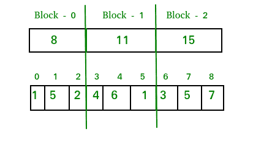
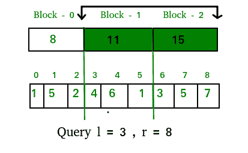

# Sqrt（或平方根）分解技术 系列 1（简介）

> 原文： [https://www.geeksforgeeks.org/sqrt-square-root-decomposition-technique-set-1-introduction/](https://www.geeksforgeeks.org/sqrt-square-root-decomposition-technique-set-1-introduction/)

Sqrt（或平方根）分解技术是竞争程序员使用的最常见的[通用查询优化技术之一。 此技术帮助我们将时间复杂度降低 **sqrt（n）**。](https://www.geeksforgeeks.org/range-minimum-query-for-static-array/)

*该技术的关键概念是将给定的数组分解为大小为 sqrt（n）的小块。*

假设我们有一个 n 个元素的数组，然后将其分解为大小为 sqrt（n）的小块。 如果 n 是一个完美的正方形，我们将恰好具有 sqrt（n）这样的块。 因此，现在我们将 n 个元素上的数组分解为 sqrt（n）块，其中每个块都包含 sqrt（n）元素（假设数组的大小是完美正方形）。

让我们将这些块或块视为一个单独的数组，每个数组包含 sqrt（n）元素，并且您已经针对所有块分别计算了所需的答案（根据您的问题）。 现在，您需要回答某些查询，询问原始 n 大小数组中范围为 l 到 r（l 和 r 是数组的开始和结束索引）的元素的答案。

**朴素的方法**只是简单地遍历范围 l 到 r 中的每个元素，并计算其相应的答案。 因此，每个查询的时间复杂度将为 O（n）。

**Sqrt 分解技巧**：由于我们已经预先计算了所有单个数据块的答案，现在我们需要回答范围 l 到 r 的查询。 现在，我们可以简单地组合原始数组中介于 l 到 r 之间的块的答案。 因此，如果我们在这里仔细观察，我们将一次跳过 sqrt（n）步，而不是像幼稚的方法那样一次跳过 1 步。 让我们考虑以下问题来分析其时间复杂度和实现：-

```
Problem :
Given an array of n elements. We need to answer q 
queries telling the sum of elements in range l to 
r in the array. Also the array is not static i.e 
the values are changed via some point update query.

Range Sum Queries are of form : Q l r , 
where l is the starting index r is the ending 
index

Point update Query is of form : U idx val, 
where idx is the index to update val is the 
updated value

```

让我们考虑一下，我们有 9 个元素组成的数组。
**A [] = {1、5、2、4、6、1、3、5、7}**

让我们将此数组分解为 sqrt（9）块，其中每个块将包含其中的元素总和。 因此，现在我们的分解数组将如下所示：



到目前为止，我们已经构造了分解后的 sqrt（9）块数组，现在我们需要打印给定范围内的元素总数。 因此，首先让我们看一下范围查询可以在数组上出现的两种基本重叠类型：

**类型 1 的范围查询（给定范围位于块边界上）**：



在这种类型的查询中，范围可能完全覆盖连续的 sqrt 块。 因此，我们可以轻松地将此范围内的值之和回答为完全重叠的块之和。
*因此，上述图像中上述查询的答案将是：* ans = 11 + 15 = 26
**时间复杂度**：在最坏的情况下，我们的范围可以是 0 至 n-1（其中 n 是数组的大小，并假设 n 是一个完美的正方形）。 在这种情况下，我们的查询范围将所有块完全重叠。 因此，要回答此查询，我们需要遍历该数组的所有分解块，并且知道块数= sqrt（n）。 因此，在最坏的情况下，此类查询的复杂度将为 **O（sqrt（n））**。

**类型 2 的范围查询（鉴于范围不在边界上）**


我们可以通过对位于查询范围内的完全重叠的分解块中的数据求和，然后对来自原始数组的元素进行逐一求和，而原始数组的原始块的相应块未与查询范围完全重叠，则可以处理此类查询 。
*因此，上述图像中上述查询的答案将是：* ans = 5 + 2 + 11 + 3 = 21
**时间复杂度**：让我们考虑一个查询[l = 1 且 r = n-2]（n 是数组的大小，并具有从 0 开始的索引）。 因此，对于该查询，正好（sqrt（n）– 2）块将完全重叠，其中第一个和最后一个块将部分重叠，而重叠范围之外仅剩一个元素。 因此，完全重叠的块可以在（sqrt（n）– 2）〜sqrt（n）迭代中求和，而第一个块和最后一个块需要分别遍历。 但是我们知道每个块中的元素数量为最大 sqrt（n），所以要单独总结最后一个块，我们需要进行
（sqrt（n）-1）〜sqrt（n）迭代，并且 最后一块。
因此，总体复杂度= O（sqrt（n））+ O（sqrt（n））+ O（sqrt（n））= O（3 * sqrt（N））= **O（sqrt（ n））**

**更新查询（点更新）**：

在此查询中，我们仅查找给定索引所在的块，然后减去其先前的值并根据点更新查询添加新的更新值。
**时间复杂度**： O（1）

**实现**：

下面给出了上述技巧的实现

## C++ 

```cpp

// C++ program to demonstrate working of Square Root 
// Decomposition. 
#include "iostream" 
#include "math.h" 
using namespace std; 

#define MAXN 10000 
#define SQRSIZE  100 

int arr[MAXN];               // original array 
int block[SQRSIZE];          // decomposed array 
int blk_sz;                      // block size 

// Time Complexity : O(1) 
void update(int idx, int val) 
{ 
    int blockNumber = idx / blk_sz; 
    block[blockNumber] += val - arr[idx]; 
    arr[idx] = val; 
} 

// Time Complexity : O(sqrt(n)) 
int query(int l, int r) 
{ 
    int sum = 0; 
    while (l<r and l%blk_sz!=0 and l!=0) 
    { 
        // traversing first block in range 
        sum += arr[l]; 
        l++; 
    } 
    while (l+blk_sz <= r) 
    { 
        // traversing completely overlapped blocks in range 
        sum += block[l/blk_sz]; 
        l += blk_sz; 
    } 
    while (l<=r) 
    { 
        // traversing last block in range 
        sum += arr[l]; 
        l++; 
    } 
    return sum; 
} 

// Fills values in input[] 
void preprocess(int input[], int n) 
{ 
    // initiating block pointer 
    int blk_idx = -1; 

    // calculating size of block 
    blk_sz = sqrt(n); 

    // building the decomposed array 
    for (int i=0; i<n; i++) 
    { 
        arr[i] = input[i]; 
        if (i%blk_sz == 0) 
        { 
            // entering next block 
            // incementing block pointer 
            blk_idx++; 
        } 
        block[blk_idx] += arr[i]; 
    } 
} 

// Driver code 
int main() 
{ 
    // We have used separate array for input because 
    // the purpose of this code is to explain SQRT 
    // decomposition in competitive programming where 
    // we have multiple inputs. 
    int input[] = {1, 5, 2, 4, 6, 1, 3, 5, 7, 10}; 
    int n = sizeof(input)/sizeof(input[0]); 

    preprocess(input, n); 

    cout << "query(3,8) : " << query(3, 8) << endl; 
    cout << "query(1,6) : " << query(1, 6) << endl; 
    update(8, 0); 
    cout << "query(8,8) : " << query(8, 8) << endl; 
    return 0; 
} 

```