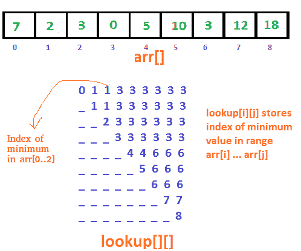

# 范围最小查询（平方根分解和稀疏表）

> 原文： [https://www.geeksforgeeks.org/range-minimum-query-for-static-array/](https://www.geeksforgeeks.org/range-minimum-query-for-static-array/)

我们有一个数组 arr [0。 。 。 n-1]。 我们应该能够有效地找到从索引 L（查询开始）到 R（查询结束）的最小值，其中 0 < = **L** < = **R** < ＝ **n-1** 。 考虑存在许多范围查询的情况。

**示例：**

```
Input:  arr[]   = {7, 2, 3, 0, 5, 10, 3, 12, 18};
        query[] = [0, 4], [4, 7], [7, 8]

Output: Minimum of [0, 4] is 0
        Minimum of [4, 7] is 3
        Minimum of [7, 8] is 12

```

**简单解决方案**是运行从 **L** 到 **R** 的循环，并找到给定范围内的最小元素。 在最坏的情况下，此解决方案需要 **O（n）**时间来查询。

另一种方法是使用 **[段树](https://www.geeksforgeeks.org/segment-tree-set-1-range-minimum-query/)** 。 对于段树，预处理时间为 O（n），到范围最小查询的时间为 **O（Logn）**。 存储段树所需的额外空间为 O（n）。 段树也允许在 **O（Log n）**时间进行更新。

### 如果我们知道数组是静态的，我们可以做得更好吗？

没有更新操作且范围最小查询很多时，如何优化查询时间？

以下是不同的方法。

**方法 1（简单解决方案）**
一个简单解决方案是创建 2D 数组 lookup [] []，其中条目 lookup [i] [j]将最小值存储在 arr [i。]中。 j]。 现在可以在 O（1）时间中计算给定范围的最小值。



## C++ 

```

// C++ program to do range minimum query in O(1) time with O(n*n) 
// extra space and O(n*n) preprocessing time. 
#include<bits/stdc++.h> 
using namespace std; 
#define MAX 500 

// lookup[i][j] is going to store index of minimum value in 
// arr[i..j] 
int lookup[MAX][MAX]; 

// Structure to represent a query range 
struct Query 
{ 
    int L, R; 
}; 

// Fills lookup array lookup[n][n] for all possible values of 
// query ranges 
void preprocess(int arr[], int n) 
{ 
    // Initialize lookup[][] for the intervals with length 1 
    for (int i = 0; i < n; i++) 
        lookup[i][i] = i; 

    // Fill rest of the entries in bottom up manner 
    for (int i=0; i<n; i++) 
    { 
        for (int j = i+1; j<n; j++) 

           // To find minimum of [0,4], we compare minimum of 
           // arr[lookup[0][3]] with arr[4]. 
           if (arr[lookup[i][j - 1]] < arr[j]) 
              lookup[i][j] = lookup[i][j - 1]; 
           else
              lookup[i][j] = j; 
    } 
} 

// Prints minimum of given m query ranges in arr[0..n-1] 
void RMQ(int arr[], int n, Query q[], int m) 
{ 
    // Fill lookup table for all possible input queries 
    preprocess(arr, n); 

    // One by one compute sum of all queries 
    for (int i=0; i<m; i++) 
    { 
        // Left and right boundaries of current range 
        int L = q[i].L, R = q[i].R; 

        // Print sum of current query range 
        cout << "Minimum of [" << L << ", "
             << R << "] is "  << arr[lookup[L][R]] << endl; 
    } 
} 

// Driver program 
int main() 
{ 
    int a[] = {7, 2, 3, 0, 5, 10, 3, 12, 18}; 
    int n = sizeof(a)/sizeof(a[0]); 
    Query q[] = {{0, 4}, {4, 7}, {7, 8}}; 
    int m = sizeof(q)/sizeof(q[0]); 
    RMQ(a, n, q, m); 
    return 0; 
} 

```