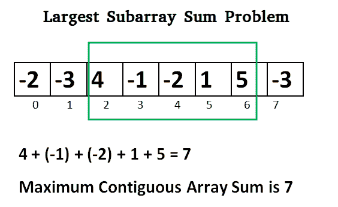

# 最大总和连续子数组

> 原文： [https://www.geeksforgeeks.org/largest-sum-contiguous-subarray/](https://www.geeksforgeeks.org/largest-sum-contiguous-subarray/)

编写一个有效的程序，以在具有最大和的一维数字数组中找到连续子数组的和。




**Kadane 的算法**：

```
Initialize:
    max_so_far = 0
    max_ending_here = 0

Loop for each element of the array
  (a) max_ending_here = max_ending_here + a[i]
  (b) if(max_ending_here < 0)
            max_ending_here = 0
  (c) if(max_so_far < max_ending_here)
            max_so_far = max_ending_here
return max_so_far

```

**说明**：
Kadane 算法的简单思路是查找数组的所有正连续段（为此使用 max_ending_here）。 并跟踪所有正分段中的最大和连续分段（为此使用 max_so_far）。 每次我们获得正和时，请将其与 max_so_far 进行比较，如果大于 max_so_far，则更新 max_so_far

```
    Lets take the example:
    {-2, -3, 4, -1, -2, 1, 5, -3}

    max_so_far = max_ending_here = 0

    for i=0,  a[0] =  -2
    max_ending_here = max_ending_here + (-2)
    Set max_ending_here = 0 because max_ending_here < 0

    for i=1,  a[1] =  -3
    max_ending_here = max_ending_here + (-3)
    Set max_ending_here = 0 because max_ending_here < 0

    for i=2,  a[2] =  4
    max_ending_here = max_ending_here + (4)
    max_ending_here = 4
    max_so_far is updated to 4 because max_ending_here greater 
    than max_so_far which was 0 till now

    for i=3,  a[3] =  -1
    max_ending_here = max_ending_here + (-1)
    max_ending_here = 3

    for i=4,  a[4] =  -2
    max_ending_here = max_ending_here + (-2)
    max_ending_here = 1

    for i=5,  a[5] =  1
    max_ending_here = max_ending_here + (1)
    max_ending_here = 2

    for i=6,  a[6] =  5
    max_ending_here = max_ending_here + (5)
    max_ending_here = 7
    max_so_far is updated to 7 because max_ending_here is 
    greater than max_so_far

    for i=7,  a[7] =  -3
    max_ending_here = max_ending_here + (-3)
    max_ending_here = 4

```

**程序**：

## C++ 

```cpp

// C++ program to print largest contiguous array sum 
#include<iostream> 
#include<climits> 
using namespace std; 

int maxSubArraySum(int a[], int size) 
{ 
    int max_so_far = INT_MIN, max_ending_here = 0; 

    for (int i = 0; i < size; i++) 
    { 
        max_ending_here = max_ending_here + a[i]; 
        if (max_so_far < max_ending_here) 
            max_so_far = max_ending_here; 

        if (max_ending_here < 0) 
            max_ending_here = 0; 
    } 
    return max_so_far; 
} 

/*Driver program to test maxSubArraySum*/
int main() 
{ 
    int a[] = {-2, -3, 4, -1, -2, 1, 5, -3}; 
    int n = sizeof(a)/sizeof(a[0]); 
    int max_sum = maxSubArraySum(a, n); 
    cout << "Maximum contiguous sum is " << max_sum; 
    return 0; 
} 

```