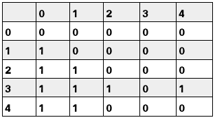

# 查找数组中的对数（x，y），使得 x ^ y > y ^ x

> 原文： [https://www.geeksforgeeks.org/find-number-pairs-xy-yx/](https://www.geeksforgeeks.org/find-number-pairs-xy-yx/)

给定正整数的两个数组 X []和 Y []，找到对数，使得 **x ^ y > y ^ x** 其中 x 是 X []的元素，而 y 是 X []的元素 Y []。

例子：

> **输入**： X [] = {2，1，6}，Y = {1，5}
> **输出**： 3
> **说明**： 共 3 对，其中 pow（x，y）比 pow（y，x）大
> 对是（2，1），（2，5）和（6，1）
> 
> **输入**： X [] = {10，19，18}，Y [] = {11，15，9}
> **输出**： 2
> **说明 **：总共有 2 对，其中 pow（x，y）比 pow（y，x）大
> 对是（10，11）和（10，15）

## [推荐：请先在“ ***实践*** ”上解决它，然后再继续解决。](https://practice.geeksforgeeks.org/problems/number-of-pairs/0)

**蛮力解**将考虑 X []和 Y []的每个元素，并检查给定条件是否满足。

Following is C++ code based on brute force solution.

## Python3

```

def countPairsBruteForce(X, Y, m, n): 
    ans = 0 
    for i in range(m): 
        for j in range(n): 
            if (pow(X[i], Y[j]) > pow(Y[j], X[i])): 
                ans+=1 
    return ans  

# This code is contributed by shubhamsingh10 

```

## C++ 

```

int countPairsBruteForce(int X[], int Y[], int m, int n) 
{ 
    int ans = 0; 
    for (int i = 0; i < m; i++) 
       for (int j = 0; j < n; j++) 
          if (pow(X[i], Y[j]) > pow(Y[j], X[i])) 
              ans++; 
    return ans; 
} 

```

**时间复杂度**：O（M * N），其中 **M** 和 **N** 是给定数组的大小。

**有效解决方案**：
该问题可以在 **O（nLogn + mLogn）**时间内解决。 这里的窍门是，如果 **y > x** ，则 **x ^ y > y ^ x** 除外。

以下是基于此技巧的简单步骤。

*   对数组 Y []进行排序。
*   对于[[X]]中的每个 x，请使用**二分搜索**查找 Y []中大于 x 的最小数字的索引 idx（也称为 x 的 ceil），或者我们可以使用内置函数 [upper_bound（ ）](http://www.geeksforgeeks.org/stdupper_bound-in-cpp/)在算法库中。
*   idx 之后的所有数字都满足关系，因此只需将（n-idx）添加到计数中即可。

**基本情况和例外**：
以下是 X []中的 x 和 Y []中的 y 的例外。

*   如果 x = 0，则此 x 的对数为 0。
*   如果 x = 1，则此 x 的对数等于 Y []中的 0s 数。
*   x 小于 y 表示 x ^ y 大于 y ^ x。
    1.  x = 2，y = 3 或 4
    2.  x = 3，y = 2

注意，不存在 x = 4 和 y = 2 的情况

下图以表格形式显示了所有例外情况。 值 1 表示对应的（x，y）形成有效对。


在以下实现中，我们对 Y 数组进行预处理，并对其中的 0、1、2、3 和 4 进行计数，以便我们可以在恒定时间内处理所有异常。 数组 NoOfY []用于存储计数。

下面是上述方法的实现：

## C++

```

// C++ program to finds the number of pairs (x, y) 
// in an array such that x^y > y^x 

#include<bits/stdc++.h> 
using namespace std; 

// Function to return count of pairs with x as one element 
// of the pair. It mainly looks for all values in Y[] where 
// x ^ Y[i] > Y[i] ^ x 
int count(int x, int Y[], int n, int NoOfY[]) 
{ 
    // If x is 0, then there cannot be any value in Y such that 
    // x^Y[i] > Y[i]^x 
    if (x == 0) return 0; 

    // If x is 1, then the number of pais is equal to number of 
    // zeroes in Y[] 
    if (x == 1) return NoOfY[0]; 

    // Find number of elements in Y[] with values greater than x 
    // upper_bound() gets address of first greater element in Y[0..n-1] 
    int* idx = upper_bound(Y, Y + n, x); 
    int ans = (Y + n) - idx; 

    // If we have reached here, then x must be greater than 1, 
    // increase number of pairs for y=0 and y=1 
    ans += (NoOfY[0] + NoOfY[1]); 

    // Decrease number of pairs for x=2 and (y=4 or y=3) 
    if (x == 2)  ans -= (NoOfY[3] + NoOfY[4]); 

    // Increase number of pairs for x=3 and y=2 
    if (x == 3)  ans += NoOfY[2]; 

    return ans; 
} 

// Function to return count of pairs (x, y) such that 
// x belongs to X[], y belongs to Y[] and x^y > y^x 
int countPairs(int X[], int Y[], int m, int n) 
{ 
    // To store counts of 0, 1, 2, 3 and 4 in array Y 
    int NoOfY[5] = {0}; 
    for (int i = 0; i < n; i++) 
        if (Y[i] < 5) 
            NoOfY[Y[i]]++; 

    // Sort Y[] so that we can do binary search in it 
    sort(Y, Y + n); 

    int total_pairs = 0; // Initialize result 

    // Take every element of X and count pairs with it 
    for (int i=0; i<m; i++) 
        total_pairs += count(X[i], Y, n, NoOfY); 

    return total_pairs; 
} 

// Driver program  
int main() 
{ 
    int X[] = {2, 1, 6}; 
    int Y[] = {1, 5}; 

    int m = sizeof(X)/sizeof(X[0]); 
    int n = sizeof(Y)/sizeof(Y[0]); 

    cout << "Total pairs = " << countPairs(X, Y, m, n); 

    return 0; 
}

```