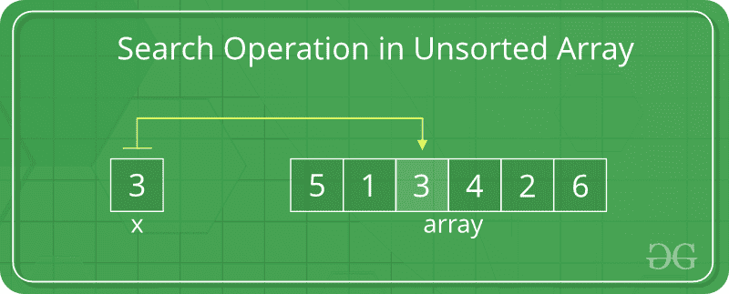
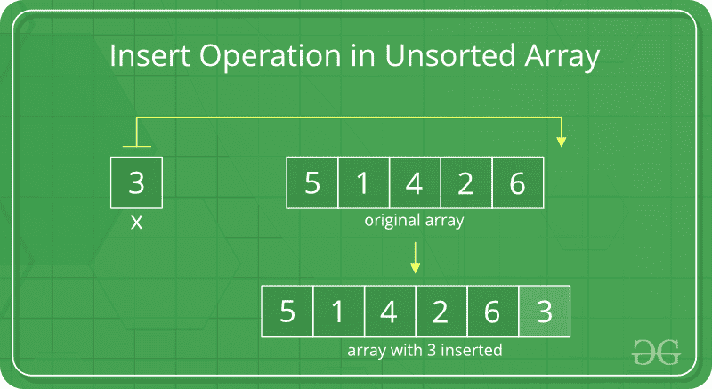
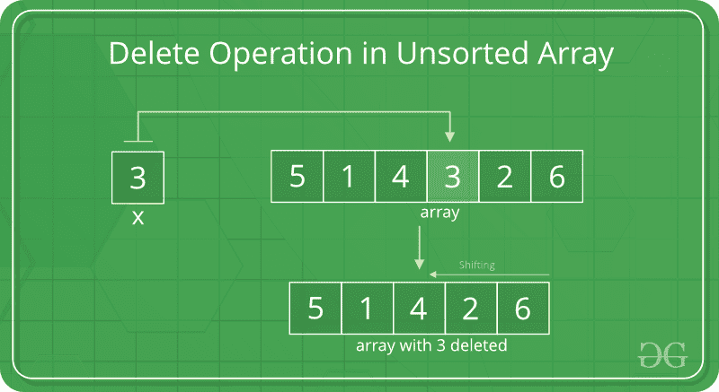

# 搜索，插入和删除未排序的数组

> 原文： [https://www.geeksforgeeks.org/search-insert-and-delete-in-an-unsorted-array/](https://www.geeksforgeeks.org/search-insert-and-delete-in-an-unsorted-array/)

在此后搜索中，讨论了未排序数组中的插入和删除操作。

> [推荐：请先在“ ***实践*** ”上解决它，然后再继续解决。](https://practice.geeksforgeeks.org/problems/operating-an-array/1)

**搜索操作**

在未排序的数组中，搜索操作可以通过从第一个元素到最后一个元素的线性遍历来执行。



## C++ 

```cpp

// C++ program to implement linear  
// search in unsorted array 
#include<bits/stdc++.h> 
using namespace std; 

// Function to implement search operation  
int findElement(int arr[], int n,  
                int key) 
{ 
    int i; 
    for (i = 0; i < n; i++) 
        if (arr[i] == key) 
            return i; 

    return -1; 
} 

// Driver Code 
int main() 
{ 
    int arr[] = {12, 34, 10, 6, 40}; 
    int n = sizeof(arr) / sizeof(arr[0]); 

    // Using a last element as search element 
    int key = 40; 
    int position = findElement(arr, n, key); 

    if (position == - 1) 
        cout << "Element not found"; 
    else
        cout << "Element Found at Position: " 
             << position + 1; 

    return 0; 
} 

// This code is contributed  
// by Akanksha Rai 

```

## C

```

// C program to implement linear  
// search in unsorted array 
#include<stdio.h> 

// Function to implement search operation  
int findElement(int arr[], int n,  
                int key) 
{ 
    int i; 
    for (i = 0; i < n; i++) 
        if (arr[i] == key) 
            return i; 

    return -1; 
} 

// Driver Code 
int main() 
{ 
    int arr[] = {12, 34, 10, 6, 40}; 
    int n = sizeof(arr) / sizeof(arr[0]); 

    // Using a last element as search element 
    int key = 40; 
    int position = findElement(arr, n, key); 

    if (position == - 1) 
        printf("Element not found"); 
    else
        printf("Element Found at Position: %d", position + 1 ); 

    return 0; 
} 

```

## Java

```java

// Java program to implement linear  
// search in unsorted arrays 

class Main 
{ 
    // Function to implement  
    // search operation  
    static int findElement(int arr[], int n,  
                           int key) 
    { 
        for (int i = 0; i < n; i++) 
            if (arr[i] == key) 
                return i; 

        return -1; 
    } 

    // Driver Code 
    public static void main(String args[]) 
    { 
        int arr[] = {12, 34, 10, 6, 40}; 
        int n = arr.length; 

        // Using a last element as search element 
        int key = 40; 
        int position = findElement(arr, n, key); 

        if (position == - 1) 
            System.out.println("Element not found"); 
        else
            System.out.println("Element Found at Position: " 
                                + (position + 1)); 
    } 
} 

```

## Python

```

# Python program for searching in 
# unsorted array 

def findElement(arr, n, key): 
    for i in range (n): 
        if (arr[i] == key): 
            return i 
    return -1

arr = [12, 34, 10, 6, 40] 
key = 40
n = len(arr) 

#search operation 
index = findElement(arr, n, key) 
if index != -1: 
    print ("element found at position: " + str(index + 1 ))  
else: 
    print ("element not found") 

# Thanks to Aditi Sharma for contributing  
# this code     

```

## C# 

```cs

// C# program to implement linear  
// search in unsorted arrays 
using System; 

class main 
{ 
    // Function to implement  
    // search operation  
    static int findElement(int []arr, int n,  
                           int key) 
    { 
        for (int i = 0; i < n; i++) 
            if (arr[i] == key) 
                return i; 

        return -1; 
    } 

    // Driver Code 
    public static void Main() 
    { 
        int []arr = {12, 34, 10, 6, 40}; 
        int n = arr.Length; 

        // Using a last element as  
        // search element 
        int key =40; 
        int position = findElement(arr,n,key); 

        if (position == - 1) 
        Console.WriteLine("Element not found"); 
        else
        Console.WriteLine("Element Found at Position: "
                            + (position+1)); 
    } 
} 

//  This code is contributed by vt_m. 

```

## PHP

```php

<?php 
// PHP program to implement linear  
// search in unsorted array 

// Function to implement 
// search operation  
function findElement($arr, $n, $key) 
{ 
    $i; 
    for ($i = 0; $i < $n; $i++) 
        if ($arr[$i] == $key) 
            return $i; 

    return -1; 
} 

// Driver Code 
$arr = array(12, 34, 10, 6, 40); 
$n = sizeof($arr); 

// Using a last element 
// as search element 
$key = 40; 
$position = findElement($arr, $n, $key); 

if ($position == - 1) 
    echo("Element not found"); 
else
    echo("Element Found at Position: " . ($position + 1)); 

// This code is contributed by Ajit. 
?> 

```

Output:

```
Element Found at Position: 5

```

**在末尾插入**

在未排序的数组中，插入操作比已排序的数组要快，这是因为我们不必关心元素放置的位置。



## C++

```

// C++ program to implement insert  
// operation in an unsorted array. 
#include <iostream> 
using namespace std; 

// Inserts a key in arr[] of given capacity. 
// n is current size of arr[]. This  
// function returns n + 1 if insertion 
// is successful, else n. 
int insertSorted(int arr[], int n,  
                int key, 
                int capacity) 
{ 

    // Cannot insert more elements if n is  
    // already more than or equal to capcity 
    if (n >= capacity) 
    return n; 

    arr[n] = key; 

    return (n + 1); 
} 

// Driver Code 
int main() 
{ 
    int arr[20] = {12, 16, 20, 40, 50, 70}; 
    int capacity = sizeof(arr) / sizeof(arr[0]); 
    int n = 6; 
    int i, key = 26; 

    cout << "\n Before Insertion: "; 
    for (i = 0; i < n; i++) 
        cout << arr[i]<< " "; 

    // Inserting key 
    n = insertSorted(arr, n, key, capacity); 

    cout << "\n After Insertion: "; 
    for (i = 0; i < n; i++) 
        cout << arr[i] << " "; 

    return 0; 
} 

// This code is contributed by SHUBHAMSINGH10 

```

## C

```

// C program to implement insert  
// operation in an unsorted array. 
#include<stdio.h> 

// Inserts a key in arr[] of given capacity. 
// n is current size of arr[]. This  
// function returns n + 1 if insertion 
// is successful, else n. 
int insertSorted(int arr[], int n,  
                 int key, 
                 int capacity) 
{ 

    // Cannot insert more elements if n is  
    // already more than or equal to capcity 
    if (n >= capacity) 
       return n; 

    arr[n] = key; 

    return (n + 1); 
} 

// Driver Code 
int main() 
{ 
    int arr[20] = {12, 16, 20, 40, 50, 70}; 
    int capacity = sizeof(arr) / sizeof(arr[0]); 
    int n = 6; 
    int i, key = 26; 

    printf("\n Before Insertion: "); 
    for (i = 0; i < n; i++) 
        printf("%d  ", arr[i]); 

    // Inserting key 
    n = insertSorted(arr, n, key, capacity); 

    printf("\n After Insertion: "); 
    for (i = 0; i < n; i++) 
        printf("%d  ",arr[i]); 

    return 0; 
} 

```

## Java

```java

// Java program to implement insert  
// operation in an unsorted array. 

class Main 
{ 
    // Function to insert a given key in  
    // the array. This function returns n+1  
    // if insertion is successful, else n.  
    static int insertSorted(int arr[], int n,  
                            int key,  
                            int capacity) 
    { 

        // Cannot insert more elements if n  
        // is already more than or equal to  
        // capcity 
        if (n >= capacity) 
           return n; 

        arr[n] = key; 

        return (n + 1); 
    } 

    // Driver Code 
    public static void main (String[] args) 
    {    
        int[] arr = new int[20];  
        arr[0] = 12; 
        arr[1] = 16; 
        arr[2] = 20; 
        arr[3] = 40;  
        arr[4] = 50; 
        arr[5] = 70; 
        int capacity = 20; 
        int n = 6; 
        int i, key = 26; 

        System.out.print("Before Insertion: "); 
        for (i = 0; i < n; i++) 
            System.out.print(arr[i]+" "); 

        // Inserting key 
        n = insertSorted(arr, n, key, capacity); 

        System.out.print("\n After Insertion: "); 
        for (i = 0; i < n; i++) 
            System.out.print(arr[i]+" "); 
    } 
} 

```

## Python

```

# Python program for inserting 
# an element in an unsorted array 

# method to insert element 
def insert(arr, element): 
    arr.append(element) 

# declaring array and key to insert  
arr = [12, 16, 20, 40, 50, 70] 
key = 26

# array before inserting an element 
print ("Before Inserting: ") 
print (arr) 

# array after Inserting element  
insert(arr, key) 
print("After Inserting: ") 
print (arr) 

# Thanks to Aditi Sharma for contributing  
# this code     

```

## C#

```

// C# program to implement insert  
// operation in an unsorted array. 
using System; 

class main 
{ 

    // Function to insert a given  
    // key in the array. This  
    // function  returns n + 1  
    // if insertion is successful, 
    // else n.  
    static int insertSorted(int []arr, int n,  
                            int key,  
                            int capacity) 
    { 

        // Cannot insert more elements 
        // if n is already more than  
        // or equal to capcity  
        if (n >= capacity) 
        return n; 

        arr[n] = key; 
        return (n + 1); 
    } 

    // Driver Code 
    public static void Main () 
    {  
        int[] arr = new int[20];  
        arr[0] = 12; 
        arr[1] = 16; 
        arr[2] = 20; 
        arr[3] = 40;  
        arr[4] = 50; 
        arr[5] = 70; 
        int capacity = 20; 
        int n = 6; 
        int i, key = 26; 

        Console.Write("Before Insertion: "); 
        for (i = 0; i < n; i++) 
            Console.Write(arr[i]+" "); 
            Console.WriteLine(); 

        // Inserting key 
        n = insertSorted(arr, n, key, capacity); 

        Console.Write("After Insertion: "); 
        for (i = 0; i < n; i++) 
            Console.Write(arr[i]+" "); 

    } 
} 

// This code is contributed by vt_m. 

```

## PHP

```php

<?php 
// PHP program to implement insert  
// operation in an unsorted array.  

// Inserts a key in arr[] of given  
// capacity. n is current size of arr[].  
// This function returns n + 1 if  
// insertion is successful, else n.  
function insertSorted(&$arr, $n, $key,  
                           $capacity)  
{  

    // Cannot insert more elements if n is  
    // already more than or equal to capcity  
    if ($n >= $capacity)  
        return $n;  

    array_push($arr, $key);  

    return ($n + 1);  
}  

// Driver Code 

$arr = array(12, 16, 20, 40, 50, 70);  
$capacity = 20;  
$n = 6;  
$key = 26;  

echo "Before Insertion: ";  
for ($i = 0; $i < $n; $i++)  
    echo $arr[$i] . " ";  

// Inserting key  
$n = insertSorted($arr, $n,  
                  $key, $capacity);  

echo "\nAfter Insertion: ";  
for ($i = 0; $i < $n; $i++)  
    echo $arr[$i] . " ";  

// This code is contributed by 
// Rajput-Ji 
?> 

```

**输出**：

```
Before Insertion: 12 16 20 40 50 70 
After Insertion: 12 16 20 40 50 70 26 

```

**删除操作**

在删除操作中，使用[线性搜索](http://quiz.geeksforgeeks.org/linear-search/)搜索要删除的元素，然后执行删除操作，然后移动元素。



## C++

```

// C++ program to implement delete operation in a  
// unsorted array  
#include <iostream> 
using namespace std; 

// To search a key to be deleted  
int findElement(int arr[], int n,  
                int key);  

// Function to delete an element  
int deleteElement(int arr[], int n,  
                int key)  
{  
    // Find position of element to be deleted  
    int pos = findElement(arr, n, key);  

    if (pos == - 1)  
    {  
        cout << "Element not found";  
        return n;  
    }  

    // Deleting element  
    int i;  
    for (i = pos; i < n - 1; i++)  
        arr[i] = arr[i + 1];  

    return n - 1;  
}  

// Function to implement search operation  
int findElement(int arr[], int n, int key)  
{  
    int i;  
    for (i = 0; i < n; i++)  
        if (arr[i] == key)  
            return i;  

    return - 1;  
}  

// Driver code  
int main()  
{  
    int i;  
    int arr[] = {10, 50, 30, 40, 20};  

    int n = sizeof(arr) / sizeof(arr[0]);  
    int key = 30;  

    cout << "Array before deletion\n";  
    for (i = 0; i < n; i++)  
    cout << arr[i] <<" " ;  

    n = deleteElement(arr, n, key);  

    cout << "\n\nArray after deletion\n";  
    for (i = 0; i < n; i++)  
    cout << arr[i] << " ";  

    return 0;  
}  

// This code is contributed by shubhamsingh10 

```

## C

```

// C program to implement delete operation in a 
// unsorted array 
#include<stdio.h> 

// To search a key to be deleted 
int findElement(int arr[], int n, 
                int key); 

// Function to delete an element 
int deleteElement(int arr[], int n,  
                  int key) 
{ 
    // Find position of element to be deleted 
    int pos = findElement(arr, n, key); 

    if (pos == - 1) 
    { 
        printf("Element not found"); 
        return n; 
    } 

    // Deleting element 
    int i; 
    for (i = pos; i < n - 1; i++) 
        arr[i] = arr[i + 1]; 

    return n - 1; 
} 

// Function to implement search operation  
int findElement(int arr[], int n, int key) 
{ 
    int i; 
    for (i = 0; i < n; i++) 
        if (arr[i] == key) 
            return i; 

    return - 1; 
} 

// Driver code 
int main() 
{ 
    int i; 
    int arr[] = {10, 50, 30, 40, 20}; 

    int n = sizeof(arr) / sizeof(arr[0]); 
    int key = 30; 

    printf("Array before deletion\n"); 
    for (i = 0; i < n; i++) 
      printf("%d  ", arr[i]); 

    n = deleteElement(arr, n, key); 

    printf("\nArray after deletion\n"); 
    for (i = 0; i < n; i++) 
      printf("%d  ", arr[i]); 

    return 0; 
} 

```

## Java

```java

// Java program to implement delete 
// operation in an unsorted array 

class Main 
{ 
    // function to search a key to  
    // be deleted 
    static int findElement(int arr[], int n, int key) 
    { 
        int i; 
        for (i = 0; i < n; i++) 
            if (arr[i] == key) 
                return i; 

        return -1; 
    }  

    // Function to delete an element 
    static int deleteElement(int arr[], int n, int key) 
    { 
        // Find position of element to be  
        // deleted 
        int pos = findElement(arr, n, key); 

        if (pos == -1) 
        { 
            System.out.println("Element not found"); 
            return n; 
        } 

        // Deleting element 
        int i; 
        for (i = pos; i< n - 1; i++) 
            arr[i] = arr[i + 1]; 

        return n - 1; 
    } 

    // Driver Code 
    public static void main(String args[]) 
    { 
        int i; 
        int arr[] = {10, 50, 30, 40, 20}; 

        int n = arr.length; 
        int key = 30; 

        System.out.println("Array before deletion"); 
        for (i=0; i<n; i++) 
          System.out.print(arr[i] + " "); 

        n = deleteElement(arr, n, key); 

        System.out.println("\n\nArray after deletion"); 
        for (i=0; i<n; i++) 
          System.out.print(arr[i]+" "); 
    }  
} 

```

## Python

```

# Python program to delete an element 
# from an unsorted array 

# Declaring array and key to delete 
arr = [10, 50, 30, 40, 20] 
key = 30

print("Array before deletion:") 
print arr 

# deletes key if found in the array  
# otherwise shows error not in list 
arr.remove(key) 
print("Array after deletion") 
print(arr) 

# This code is contributed by Aditi Sharma.  

```

## C#

```

// C# program to implement delete 
// operation in an unsorted array 
using System; 

class main 
{ 
    // Function to search a   
    // key to be deleted 
    static int findElement(int []arr,  
                           int n,  
                           int key) 
    { 

        int i; 
        for (i = 0; i < n; i++) 
            if (arr[i] == key) 
                return i; 

        return -1; 
    }  

    // Function to delete an element 
    static int deleteElement(int []arr, 
                             int n,  
                             int key) 
    { 
        // Find position of element  
        // to be deleted 
        int pos = findElement(arr, n, key); 

        if (pos == - 1) 
        { 
            Console.WriteLine("Element not found"); 
            return n; 
        } 

        // Deleting element 
        int i; 
        for (i = pos; i < n - 1; i++) 
            arr[i] = arr[i + 1]; 

        return n - 1; 
    } 

    // Driver Code 
    public static void Main() 
    { 
        int i; 
        int []arr = {10, 50, 30, 40, 20}; 

        int n = arr.Length; 
        int key = 30; 

        Console.Write("Array before deletion "); 
        for (i = 0; i < n; i++) 
        Console.Write(arr[i] + " "); 
        Console.WriteLine(); 

        n = deleteElement(arr, n, key); 

        Console.Write("Array after deletion "); 
        for (i = 0; i < n; i++) 
        Console.Write(arr[i]+" "); 
    }  
} 

// This code is contributed by vt_m. 

```

## PHP

```php

<?php 
// PHP program to implement delete   
// operation in an unsorted array  

// To search a key to be deleted  
function findElement(&$arr, $n, $key) 
{  
    for ($i = 0; $i < $n; $i++)  
        if ($arr[$i] == $key)  
            return $i;  

    return -1;  
}  

// Function to delete an element  
function deleteElement(&$arr, $n, $key)  
{  
    // Find position of element to  
    // be deleted  
    $pos = findElement($arr, $n, $key);  

    if ($pos == -1)  
    {  
        echo "Element not found";  
        return $n;  
    }  

    // Deleting element  
    for ($i = $pos; $i < $n - 1; $i++)  
        $arr[$i] = $arr[$i + 1];  

    return $n - 1;  
}  

// Driver code  
$arr = array(10, 50, 30, 40, 20);  

$n = count($arr);  
$key = 30;  

echo "Array before deletion\n";  
for ($i = 0; $i < $n; $i++)  
echo $arr[$i] . " ";  

$n = deleteElement($arr, $n, $key);  

echo "\nArray after deletion\n";  
for ($i = 0; $i < $n; $i++)  
echo $arr[$i] . " ";  

// This code is contributed by 
// Rajput-Ji 
?> 

```

**输出**：

```
Array before deletion
10 50 30 40 20 

Array after deletion
10 50 40 20 

```

**时间复杂度**：
**搜索**： O（n）
**插入**： O（1）
**删除**： 上）

Please write comments if you find anything incorrect, or you want to share more information about the topic discussed above

