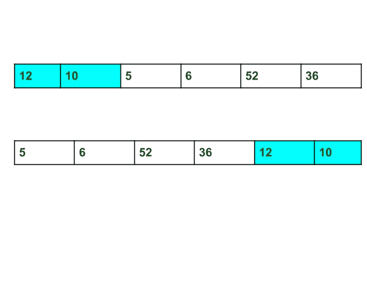

# 拆分数组并将第一部分添加到末尾

> 原文： [https://www.geeksforgeeks.org/split-array-add-first-part-end/](https://www.geeksforgeeks.org/split-array-add-first-part-end/)

有一个给定的数组，并将其从指定位置拆分，然后将数组 add 的第一部分移至末尾。


**示例**：

```
Input : arr[] = {12, 10, 5, 6, 52, 36}
            k = 2
Output : arr[] = {5, 6, 52, 36, 12, 10}
Explanation : Split from index 2 and first 
part {12, 10} add to the end .

Input : arr[] = {3, 1, 2}
           k = 1
Output : arr[] = {1, 2, 3}
Explanation : Split from index 1 and first
part add to the end.

```

## [推荐：在继续进行解决之前，请先在 ***<u>{IDE}</u>*** 上尝试您的方法。](https://ide.geeksforgeeks.org/)

**简单解决方案**
我们一对一旋转数组。

## C++ 

```

// CPP program to split array and move first 
// part to end. 
#include <bits/stdc++.h> 
using namespace std; 

void splitArr(int arr[], int n, int k) 
{ 
    for (int i = 0; i < k; i++) { 

        // Rotate array by 1\. 
        int x = arr[0]; 
        for (int j = 0; j < n - 1; ++j) 
            arr[j] = arr[j + 1]; 
        arr[n - 1] = x; 
    } 
} 

// Driver code 
int main() 
{ 
    int arr[] = { 12, 10, 5, 6, 52, 36 }; 
    int n = sizeof(arr) / sizeof(arr[0]); 
    int position = 2; 

    splitArr(arr, 6, position); 

    for (int i = 0; i < n; ++i) 
        printf("%d ", arr[i]); 

    return 0; 
} 

```