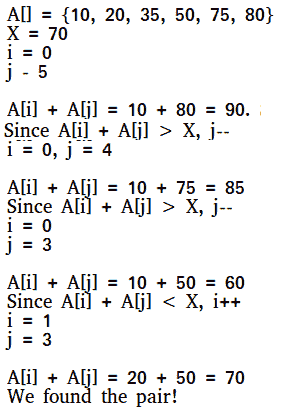

# 两指针技术

> 原文： [https://www.geeksforgeeks.org/two-pointers-technique/](https://www.geeksforgeeks.org/two-pointers-technique/)

两个指针确实是一种简单有效的技术，通常用于在排序数组中搜索对。

给定一个具有 N 个整数的排序数组 A（按升序排序），请查找是否存在任何元素对（A [i]，A [j]），以使它们的总和等于 X。

让我们看看**朴素的解决方案**。

```

// Naive solution to find if there is a 
// pair in A[0..N-1] with given sum. 

bool isPairSum(A[], N, X) 
{ 
    for (i = 0; i < N; i++) { 
        for (j = 0; j < N; j++) { 
            if (A[i] + A[j] == X) 
                return true; // pair exists 

            if (A[i] + A[j] > X) 
                break; // as the array is sorted 
        } 
    } 

    // No pair found with given sum. 
    return false; 
} 

```

该解决方案的时间复杂度为 **O（n <sup>2</sup> ）**。

现在，让我们看一下两指技术的工作原理。 我们使用两个指针，一个代表数组的第一个元素，另一个代表数组的最后一个元素，然后我们将两个指针处保存的值相加。 如果它们的总和小于 X，则将左指针向右移动；如果它们的总和大于 X，则将右指针向左移动，以便更接近和。 我们一直移动指针，直到得到和为 X。

```

// Two pointer technique based solution to find 
// if there is a pair in A[0..N-1] with a given sum. 
bool isPairSum(A[], N, X) 
{ 
    // represents first pointer 
    int i = 0; 

    // represents second pointer 
    int j = N - 1; 

    while (i < j) { 

        // If we find a pair 
        if (A[i] + A[j] == X) 
            return true; 

        // If sum of elements at current 
        // pointers is less, we move towards 
        // higher values by doing i++ 
        else if (A[i] + A[j] < X) 
            i++; 

        // If sum of elements at current 
        // pointers is more, we move towards 
        // lower values by doing j-- 
        else
            j--; 
    } 
    return false; 
} 

```

插图：


上述解决方案适用于 **O（n）**

**这是如何工作的？**
该算法基本上使用对输入数组进行排序的事实。 我们开始求和（最小和最大），然后有条件地移动两个指针。 当 A [i]和 A [j]的总和小于 X 时，我们将向左移动指针 i。我们不会错过任何一对，因为总和已经小于 X。右指针 j 的逻辑相同。

 **基于两个指针技术的更多问题。**

*   [从两个排序的数组中查找最接近的对](https://www.geeksforgeeks.org/given-two-sorted-arrays-number-x-find-pair-whose-sum-closest-x/)
*   [在数组中找到总和最接近 x 的对](https://www.geeksforgeeks.org/given-sorted-array-number-x-find-pair-array-whose-sum-closest-x/)
*   [查找总和为零的所有三胞胎](https://www.geeksforgeeks.org/find-triplets-array-whose-sum-equal-zero/)
*   [查找一个加和为给定值的三元组](https://www.geeksforgeeks.org/find-a-triplet-that-sum-to-a-given-value/)
*   [找到一个三元组，使得两个和等于第三元素](https://www.geeksforgeeks.org/find-triplet-sum-two-equals-third-element/)
*   [查找四个元素的总和为给定值](https://www.geeksforgeeks.org/find-four-numbers-with-sum-equal-to-given-sum/)

现在不要停下来，将您的学习提高到一个新的水平。 借助最受信任的课程，学习数据结构和算法的所有重要概念： [DSA Self Paced](https://practice.geeksforgeeks.org/courses/dsa-self-paced?utm_source=geeksforgeeks&utm_medium=article&utm_campaign=gfg_article_dsa_content_bottom) 。 以对学生友好的价格准备好行业。

本文由 **Rohan Das** 提供。 如果您喜欢 GeeksforGeeks 并希望做出贡献，则也可以使用 [tribution.geeksforgeeks.org](https://contribute.geeksforgeeks.org/) 撰写文章，或将您的文章邮寄至 tribution@geeksforgeeks.org。 查看您的文章出现在 GeeksforGeeks 主页上，并帮助其他 Geeks。

如果您发现任何不正确的地方，请单击下面的“改进文章”按钮，以改进本文。