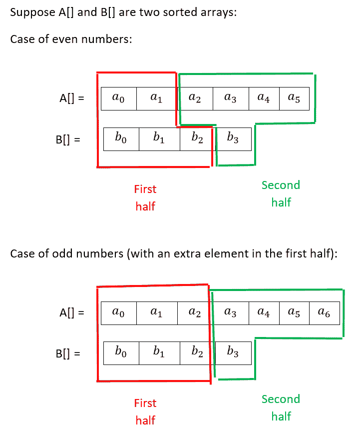
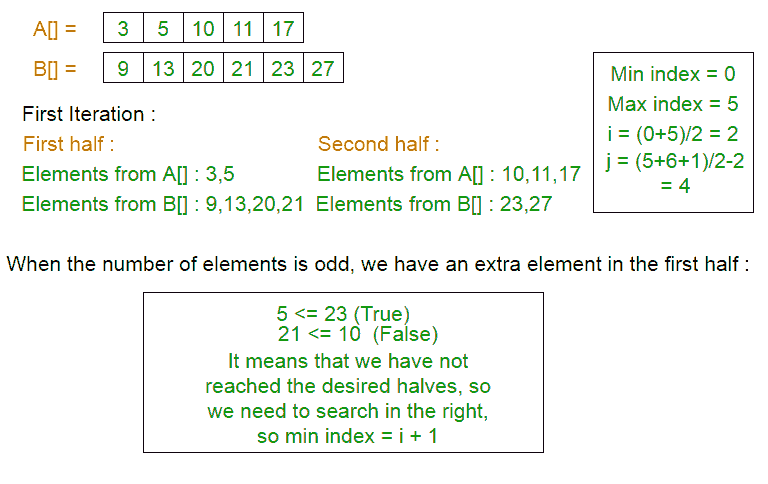
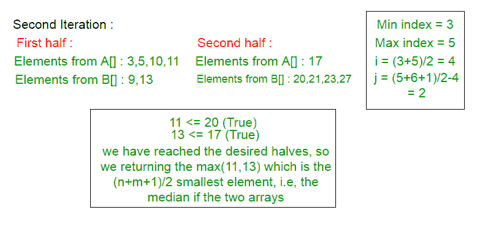
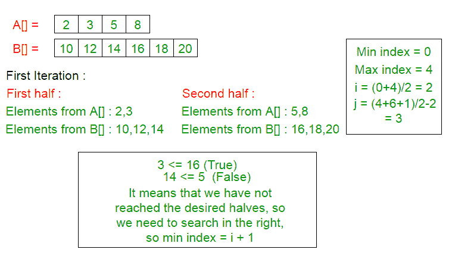
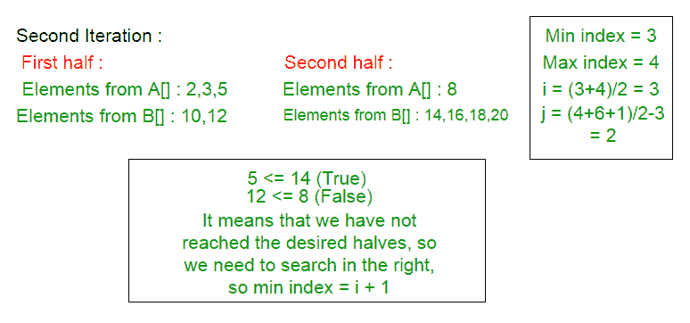
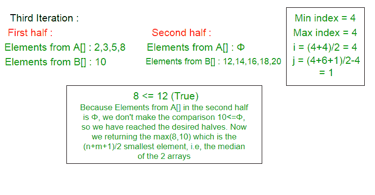

# O（log（min（n（n，m）））中具有不同大小的两个排序数组的中位数

> 原文： [https://www.geeksforgeeks.org/median-two-sorted-arrays-different-sizes-ologminn-m/](https://www.geeksforgeeks.org/median-two-sorted-arrays-different-sizes-ologminn-m/)

给定两个排序数组 a []和 b []，当 n 是第一个数组中的元素数时，任务是在 O（log（min（n（n，m）））中找到这些排序数组的中位数。 m 是第二个数组中的元素数。

**先决条件：** [两个不同大小的排序数组的中位数。](https://www.geeksforgeeks.org/median-of-two-sorted-arrays-of-different-sizes/)

**示例：**

```
Input : ar1[] = {-5, 3, 6, 12, 15}
        ar2[] = {-12, -10, -6, -3, 4, 10}
        The merged array is :
        ar3[] = {-12, -10, -6, -5 , -3,
                 3, 4, 6, 10, 12, 15}
Output : The median is 3.

Input : ar1[] = {2, 3, 5, 8}
        ar2[] = {10, 12, 14, 16, 18, 20}
        The merged array is :
        ar3[] = {2, 3, 5, 8, 10, 12, 14, 16, 18, 20}
        if the number of the elements are even, 
        so there are two middle elements,
        take the average between the two :
        (10 + 12) / 2 = 11\.      
Output : The median is 11.

```

**注意：**如果总数为偶数，并且如果我们要返回合并数组中存在的中位数，则可以返回（n + m）/ 2 或（n + m）/ 2 – 1 位。 在这种情况下，中位数可以是 10 或 12。

## [推荐：在继续进行解决之前，请先在 ***<u>{IDE}</u>*** 上尝试您的方法。](https://ide.geeksforgeeks.org/)

**方法：**开始将两个数组划分为两半（不是两个部分，但两个分区都应具有相同数量的元素）。 前半部分包含来自第一个和第二个数组的一些第一元素，后半部分包含形成第一个和第二个数组的其余（或最后一个）元素。 由于数组可以具有不同的大小，因此并不意味着要从每个数组中取出每一半。 以下示例阐明了解释。 达到这样的条件：上半部分的每个元素都小于或等于下半部分的每个元素。

**如何达到此条件？**
偶数情况下的示例。 假设找到了分区。 因为 A []和 B []是两个排序的数组，所以 a1 小于或等于 a2，b2 小于或等于 b3。 现在，检查 a1 是否小于或等于 b3，以及 b2 是否小于或等于 a2。 如果是这种情况，则意味着上半部分的每个元素都小于或等于下半部分的每个元素，因为 a1 大于或等于 A []中的每个元素（a0）和 b2 大于或等于 B []中它之前的每个元素（b1 和 b0）。 如果总数为偶数，则中位数将为 a1，b2 的最大值与 a2，b3 的最小值之间的平均值，但是如果总数为奇数，则中位数将为 a2，b2 的最大值。 但是，如果不是这两种情况，则有两种选择（以偶数示例为例）：[b] > a2 表示
b2 > a2 或 a1 > b3
，在数组的右侧搜索，如果 a1 > b3，则意味着在数组的左侧搜索，直到找到所需的条件。


**为什么上述情况导致中位数？**
中位数是数组中（n + 1）/ 2 的最小元素，此处，中位数是两个数组中（n + m + 1）/ 2 的最小元素。 如果上半部分中的所有元素都小于（或等于）下半部分中的所有元素，则在总数为奇数的情况下，只需计算上半部分的最后两个元素之间的最大值（a2 和 b2 我们的示例），这将导致我们找到两个数组中的（n + m +1）/ 2 个最小元素，即中位数（（7 + 4 +1）/ 2 = 6）。 但是在总数为偶数的情况下，请计算前半部分中最后两个元素的最大值（在我们的示例中为 a1 和 b2）之间的平均值及其在数组中的连续数，即第二个中前两个元素的最小值 一半（在我们的示例中为 a2 和 b3）。

**分区的过程：**
要分成两半，请进行分区，以使分区数组 A []的索引+分区数组 B []的索引等于元素总数 加一除以 2，即（n + m +1）/ 2（如果元素总数为奇数，则为+1）。
首先，定义两个变量：min_index 和 max_index，并将 min_index 初始化为 0，并将 max_index 初始化为较小数组的长度。 在以下这些示例中，A []是较小的数组。
要对 A []进行分区，请使用公式（min_index + max_index）/ 2 并将其插入变量 i。 要对 B []进行分区，请使用公式（n + m + 1）/ 2 – i 并将其插入变量 j。
变量 i 表示要从 A []插入到前半部分的元素数，而 j 表示要从 B []插入到前半部分的元素数，其余的元素将被插入 进入下半场。
请看以下示例：

**示例 1：**





**示例 2** （此示例是指返回合并数组中存在的中值的条件）**：**







**以下是上述方法的实现：**

## C++ 

```

// CPP code for median with case of returning  
// double value when even number of elements are  
// present in both array combinely 
#include<bits/stdc++.h> 
using std::cout; 

int maximum(int a, int b); 
int minimum(int a, int b); 

// Function to find median of two sorted arrays 
double findMedianSortedArrays(int *a, int n,  
                              int *b, int m) 
{ 

    int min_index = 0, max_index = n, i, j, median; 

    while (min_index <= max_index) 
    { 
        i = (min_index + max_index) / 2; 
        j = ((n + m + 1) / 2) - i; 

        // If j is negative then the partition is not  
        // possible having i elements from array i 
        if (j < 0) 
        { 
            max_index = i-1; 
            continue; 
        } 

        // if i = n, it means that Elements from a[] in 
        // the second half is an empty set. and if j = 0, 
        // it means that Elements from b[] in the first 
        // half is an empty set. so it is necessary to 
        // check that, because we compare elements from 
        // these two groups.  
        // Searching on right 
        if (i < n && j > 0 && b[j - 1] > a[i])         
            min_index = i + 1; 

        // if i = 0, it means that Elements from a[] in 
        // the first half is an empty set and if j = m, 
        // it means that Elements from b[] in the second 
        // half is an empty set. so it is necessary to 
        // check that, because we compare elements  
        // from these two groups. 
        // searching on left 
        else if (i > 0 && j < m && b[j] < a[i - 1])         
            max_index = i - 1; 

        // we have found the desired halves. 
        else
        { 
            // this condition happens when we don't have any 
            // elements in the first half from a[] so we 
            // returning the last element in b[] from  
            // the first half. 
            if (i == 0)             
                median = b[j - 1];             

            // and this condition happens when we don't 
            // have any elements in the first half from 
            // b[] so we returning the last element in  
            // a[] from the first half. 
            else if (j == 0)             
                median = a[i - 1];             
            else            
                median = maximum(a[i - 1], b[j - 1]);             
            break; 
        } 
    } 

    // calculating the median. 
    // If number of elements is odd there is  
    // one middle element. 
    if ((n + m) % 2 == 1) 
        return (double)median; 

    // Elements from a[] in the second half is an empty set.     
    if (i == n) 
        return (median+b[j]) / 2.0; 

    // Elements from b[] in the second half is an empty set. 
    if (j == m) 
        return (median + a[i]) / 2.0; 

    return (median + minimum(a[i], b[j])) / 2.0; 
} 

// Function to find max 
int maximum(int a, int b)  
{ 
    return a > b ? a : b; 
} 

// Function to find minimum 
int minimum(int a, int b)  
{ 
    return a < b ? a : b;  
} 

// Driver code 
int main() 
{ 
    int a[] = {900}; 
    int b[] = { 10, 13, 14}; 
    int n = sizeof(a) / sizeof(int); 
    int m = sizeof(b) / sizeof(int); 

    // we need to define the smaller array as the  
    // first parameter to make sure that the  
    // time complexity will be O(log(min(n,m))) 
    if (n < m) 
        cout << "The median is : "
             << findMedianSortedArrays(a, n, b, m); 
    else
        cout << "The median is : "
             << findMedianSortedArrays(b, m, a, n); 

    return 0; 
} 

```

## 爪哇

```

// Java code for median with  
// case of returning double  
// value when even number of  
// elements are present in  
// both array combinely 
import java.io.*; 

class GFG 
{ 
    static int []a = new int[]{900}; 
    static int []b = new int[]{10, 13, 14}; 

    // Function to find max 
    static int maximum(int a, int b)  
    { 
        return a > b ? a : b; 
    } 

    // Function to find minimum 
    static int minimum(int a, int b)  
    { 
        return a < b ? a : b;  
    } 

    // Function to find median  
    // of two sorted arrays 
    static double findMedianSortedArrays(int n,  
                                         int m) 
    { 

        int min_index = 0,  
            max_index = n, i = 0, 
            j = 0, median = 0; 

        while (min_index <= max_index) 
        { 
            i = (min_index + max_index) / 2; 
            j = ((n + m + 1) / 2) - i; 

            // if i = n, it means that Elements  
            // from a[] in the second half is an  
            // empty set. and if j = 0, it means  
            // that Elements from b[] in the first 
            // half is an empty set. so it is  
            // necessary to check that, because we 
            // compare elements from these two  
            // groups. Searching on right 
            if (i < n && j > 0 && b[j - 1] > a[i])      
                min_index = i + 1; 

            // if i = 0, it means that Elements 
            // from a[] in the first half is an  
            // empty set and if j = m, it means  
            // that Elements from b[] in the second 
            // half is an empty set. so it is  
            // necessary to check that, because  
            // we compare elements from these two 
            // groups. searching on left 
            else if (i > 0 && j < m && b[j] < a[i - 1])      
                max_index = i - 1; 

            // we have found the desired halves. 
            else
            { 
                // this condition happens when we  
                // don't have any elements in the  
                // first half from a[] so we 
                // returning the last element in  
                // b[] from the first half. 
                if (i == 0)          
                    median = b[j - 1];          

                // and this condition happens when  
                // we don't have any elements in the 
                // first half from b[] so we  
                // returning the last element in  
                // a[] from the first half. 
                else if (j == 0)          
                    median = a[i - 1];          
                else    
                    median = maximum(a[i - 1],  
                                     b[j - 1]);          
                break; 
            } 
        } 

        // calculating the median. 
        // If number of elements is odd  
        // there is one middle element. 
        if ((n + m) % 2 == 1) 
            return (double)median; 

        // Elements from a[] in the  
        // second half is an empty set.  
        if (i == n) 
            return (median + b[j]) / 2.0; 

        // Elements from b[] in the 
        // second half is an empty set. 
        if (j == m) 
            return (median + a[i]) / 2.0; 

        return (median + minimum(a[i],  
                                 b[j])) / 2.0; 
    } 

    // Driver code 
    public static void main(String args[]) 
    { 
        int n = a.length; 
        int m = b.length; 

        // we need to define the  
        // smaller array as the  
        // first parameter to  
        // make sure that the 
        // time complexity will 
        // be O(log(min(n,m))) 
        if (n < m) 
            System.out.print("The median is : " +  
                   findMedianSortedArrays(n, m)); 
        else
            System.out.print("The median is : " +  
                   findMedianSortedArrays(m, n)); 
    } 
}  

// This code is contributed by  
// Manish Shaw(manishshaw1) 

```

## Python3

```

# Python code for median with   
# case of returning double 
# value when even number  
# of elements are present 
# in both array combinely 
median = 0
i = 0 
j = 0

# def to find max 
def maximum(a, b) : 
    return a if a > b else b 

# def to find minimum 
def minimum(a, b) : 
    return a if a < b else b 

# def to find median 
# of two sorted arrays 
def findMedianSortedArrays(a, n, b, m) : 

    global median, i, j 
    min_index = 0 
    max_index = n  

    while (min_index <= max_index) : 

        i = int((min_index + max_index) / 2) 
        j = int(((n + m + 1) / 2) - i) 

        # if i = n, it means that  
        # Elements from a[] in the 
        # second half is an empty  
        # set. and if j = 0, it  
        # means that Elements from  
        # b[] in the first half is  
        # an empty set. so it is  
        # necessary to check that,  
        # because we compare elements  
        # from these two groups.  
        # Searching on right 
        if (i < n and j > 0 and b[j - 1] > a[i]) : 
            min_index = i + 1

        # if i = 0, it means that  
        # Elements from a[] in the 
        # first half is an empty  
        # set and if j = m, it means 
        # that Elements from b[] in  
        # the second half is an empty  
        # set. so it is necessary to 
        # check that, because we compare  
        # elements from these two groups. 
        # searching on left 
        elif (i > 0 and j < m and b[j] < a[i - 1]) : 
            max_index = i - 1

        # we have found the 
        # desired halves. 
        else : 

            # this condition happens when  
            # we don't have any elements  
            # in the first half from a[]  
            # so we returning the last 
            # element in b[] from the  
            # first half. 
            if (i == 0) : 
                median = b[j - 1] 

            # and this condition happens  
            # when we don't have any  
            # elements in the first half  
            # from b[] so we returning the  
            # last element in a[] from the  
            # first half. 
            elif (j == 0) : 
                median = a[i - 1]          
            else : 
                median = maximum(a[i - 1], b[j - 1])  
            break

    # calculating the median. 
    # If number of elements  
    # is odd there is  
    # one middle element. 

    if ((n + m) % 2 == 1) : 
        return median 

    # Elements from a[] in the  
    # second half is an empty set.  
    if (i == n) : 
        return ((median + b[j]) / 2.0) 

    # Elements from b[] in the  
    # second half is an empty set. 
    if (j == m) : 
        return ((median + a[i]) / 2.0) 

    return ((median + minimum(a[i], b[j])) / 2.0) 

# Driver code 
a = [900] 
b = [10, 13, 14] 
n = len(a) 
m = len(b) 

# we need to define the  
# smaller array as the  
# first parameter to make  
# sure that the time complexity 
# will be O(log(min(n,m))) 
if (n < m) : 
    print ("The median is : {}".format(findMedianSortedArrays(a, n, b, m))) 
else : 
    echo ("The median is : {}".format(findMedianSortedArrays(b, m, a, n))) 

# This code is contributed  
# by Manish Shaw(manishshaw1) 

```

## C＃

```

// C# code for median with case of returning  
// double value when even number of elements  
// are present in both array combinely 
using System; 

class GFG { 

    // Function to find max 
    static int maximum(int a, int b)  
    { 
        return a > b ? a : b; 
    } 

    // Function to find minimum 
    static int minimum(int a, int b)  
    { 
        return a < b ? a : b;  
    } 

    // Function to find median of two sorted 
    // arrays 
    static double findMedianSortedArrays(ref int []a, 
                           int n, ref int []b, int m) 
    { 

        int min_index = 0, max_index = n, i = 0, 
        j = 0, median = 0; 

        while (min_index <= max_index) 
        { 
            i = (min_index + max_index) / 2; 
            j = ((n + m + 1) / 2) - i; 

            // if i = n, it means that Elements  
            // from a[] in the second half is an  
            // empty set. and if j = 0, it means  
            // that Elements from b[] in the first 
            // half is an empty set. so it is  
            // necessary to check that, because we 
            // compare elements from these two  
            // groups. Searching on right 
            if (i < n && j > 0 && b[j - 1] > a[i])      
                min_index = i + 1; 

            // if i = 0, it means that Elements 
            // from a[] in the first half is an  
            // empty set and if j = m, it means  
            // that Elements from b[] in the second 
            // half is an empty set. so it is  
            // necessary to check that, because  
            // we compare elements from these two 
            // groups. searching on left 
            else if (i > 0 && j < m && b[j] < a[i - 1])      
                max_index = i - 1; 

            // we have found the desired halves. 
            else
            { 
                // this condition happens when we  
                // don't have any elements in the  
                // first half from a[] so we 
                // returning the last element in  
                // b[] from the first half. 
                if (i == 0)          
                    median = b[j - 1];          

                // and this condition happens when  
                // we don't have any elements in the 
                // first half from b[] so we  
                // returning the last element in  
                // a[] from the first half. 
                else if (j == 0)          
                    median = a[i - 1];          
                else        
                    median = maximum(a[i - 1], b[j - 1]);          
                break; 
            } 
        } 

        // calculating the median. 
        // If number of elements is odd  
        // there is one middle element. 
        if ((n + m) % 2 == 1) 
            return (double)median; 

        // Elements from a[] in the second  
        // half is an empty set.  
        if (i == n) 
            return (median+b[j]) / 2.0; 

        // Elements from b[] in the second  
        // half is an empty set. 
        if (j == m) 
            return (median + a[i]) / 2.0; 

        return (median + minimum(a[i], b[j])) / 2.0; 
    } 

    // Driver code 
    static void Main() 
    { 
        int []a = new int[]{900}; 
        int []b = new int[]{ 10, 13, 14}; 
        int n = a.Length; 
        int m = b.Length; 

        // we need to define the smaller  
        // array as the first parameter to  
        // make sure that the time  
        // complexity will be O(log(min(n,m))) 
        if (n < m) 
            Console.Write("The median is : "
            + findMedianSortedArrays(ref a, n,  
                                   ref b, m)); 
        else
            Console.Write("The median is : "
            + findMedianSortedArrays(ref b, m,  
                                   ref a, n)); 
    } 
} 

// This code is contributed by Manish Shaw 
// (manishshaw1) 

```

## 的 PHP

```

<?php 
// PHP code for median with   
// case of returning double 
// value when even number  
// of elements are present 
// in both array combinely 
$median = 0; 
$i = 0; $j = 0; 

// Function to find max 
function maximum($a, $b)  
{ 
    return $a > $b ? $a : $b; 
} 

// Function to find minimum 
function minimum($a, $b)  
{ 
    return $a < $b ? $a : $b;  
} 

// Function to find median 
// of two sorted arrays 
function findMedianSortedArrays(&$a, $n,  
                                &$b, $m) 
{ 
    global $median, $i, $j; 
    $min_index = 0;  
    $max_index = $n;  

    while ($min_index <= $max_index) 
    { 
        $i = intval(($min_index +  
                     $max_index) / 2); 
        $j = intval((($n + $m + 1) /  
                           2) - $i); 

        // if i = n, it means that  
        // Elements from a[] in the 
        // second half is an empty  
        // set. and if j = 0, it  
        // means that Elements from  
        // b[] in the first half is  
        // an empty set. so it is  
        // necessary to check that,  
        // because we compare elements  
        // from these two groups.  
        // Searching on right 
        if ($i < $n && $j > 0 &&  
            $b[$j - 1] > $a[$i])      
            $min_index = $i + 1; 

        // if i = 0, it means that  
        // Elements from a[] in the 
        // first half is an empty  
        // set and if j = m, it means 
        // that Elements from b[] in  
        // the second half is an empty  
        // set. so it is necessary to 
        // check that, because we compare  
        // elements from these two groups. 
        // searching on left 
        else if ($i > 0 && $j < $m &&  
                 $b[$j] < $a[$i - 1])      
            $max_index = $i - 1; 

        // we have found the 
        // desired halves. 
        else
        { 
            // this condition happens when  
            // we don't have any elements  
            // in the first half from a[]  
            // so we returning the last 
            // element in b[] from the  
            // first half. 
            if ($i == 0)  
                $median = $b[$j - 1]; 

            // and this condition happens  
            // when we don't have any  
            // elements in the first half  
            // from b[] so we returning the  
            // last element in a[] from the  
            // first half. 
            else if ($j == 0)          
                $median = $a[$i - 1];          
            else        
                $median = maximum($a[$i - 1],  
                                  $b[$j - 1]);  
            break; 
        } 
    } 

    // calculating the median. 
    // If number of elements  
    // is odd there is  
    // one middle element. 

    if (($n + $m) % 2 == 1) 
        return $median; 

    // Elements from a[] in the  
    // second half is an empty set.  
    if ($i == $n) 
        return (($median +  
                 $b[$j]) / 2.0); 

    // Elements from b[] in the  
    // second half is an empty set. 
    if ($j == $m) 
        return (($median +  
                 $a[$i]) / 2.0); 

    return (($median +  
             minimum($a[$i],  
                     $b[$j])) / 2.0); 
} 

// Driver code 
$a = array(900); 
$b = array(10, 13, 14); 
$n = count($a); 
$m = count($b); 

// we need to define the  
// smaller array as the  
// first parameter to make  
// sure that the time complexity 
// will be O(log(min(n,m))) 
if ($n < $m) 
    echo ("The median is : " .  
           findMedianSortedArrays($a, $n,  
                                  $b, $m)); 
else
    echo ("The median is : " .  
           findMedianSortedArrays($b, $m,  
                                  $a, $n)); 

// This code is contributed  
// by Manish Shaw(manishshaw1) 
?> 

```

**Output:**

```
The median is : 13.5

```

**另一种方法：**相同的程序，但是返回合并数组中存在的中位数（（n + m）/ 2-1 位置）：

## C++

```

// CPP code for finding median of the given two 
// sorted arrays that exists in the merged array ((n+m) / 2 - 1 position) 
#include<bits/stdc++.h> 
using std::cout; 

int maximum(int a, int b); 

// Function to find median of given two sorted arrays 
int findMedianSortedArrays(int *a, int n,  
                           int *b, int m) 
{ 

    int min_index = 0, max_index = n, i, j; 

    while (min_index <= max_index) 
    { 
        i = (min_index + max_index) / 2; 
        j = ((n + m + 1) / 2) - i; 

        // if i = n, it means that Elements from a[] in 
        // the second half is an empty set. If j = 0, it 
        // means that Elements from b[] in the first half 
        // is an empty set. so it is necessary to check that, 
        // because we compare elements from these two groups. 
        // searching on right 
        if (i < n && j > 0 && b[j - 1] > a[i])         
            min_index = i + 1;         

        // if i = 0, it means that Elements from a[] in the 
        // first half is an empty set and if j = m, it means 
        // that Elements from b[] in the second half is an 
        // empty set. so it is necessary to check that,  
        // because we compare elements from these two groups. 
        // searching on left 
        else if (i > 0 && j < m && b[j] < a[i - 1])         
            max_index = i - 1;         

        // we have found the desired halves. 
        else
        { 
            // this condition happens when we don't have 
            // any elements in the first half from a[] so 
            // we returning the last element in b[] from 
            // the first half. 
            if (i == 0)             
                return b[j - 1];             

            // and this condition happens when we don't have any  
            // elements in the first half from b[] so we  
            // returning the last element in a[] from the first half. 
            if (j == 0)             
                return a[i - 1];             
            else            
                return maximum(a[i - 1], b[j - 1]);            
        } 
    } 

    cout << "ERROR!!! " << "returning\n";     
    return 0; 
} 

// Function to find maximum 
int maximum(int a, int b)  
{ 
    return a > b ? a : b;  
} 

// Driver code 
int main() 
{ 
    int a[] = {900}; 
    int b[] = { 10,13,14}; 
    int n = sizeof(a) / sizeof(int); 
    int m = sizeof(b) / sizeof(int); 

    // we need to define the smaller array as the first  
    // parameter to make sure that the time complexity  
    // will be O(log(min(n,m))) 
    if (n < m) 
        cout << "The median is: "
             << findMedianSortedArrays(a, n, b, m); 
    else
        cout << "The median is: " 
             << findMedianSortedArrays(b, m, a, n); 
    return 0; 
} 

```

## C#

```

// C# code for finding median  
// of the given two sorted  
// arrays that exists in the  
// merged array ((n+m) / 2 - 
// 1 position) 
using System; 

class GFG 
{  
    // Function to find maximum 
    static int maximum(int a, 
                       int b)  
    { 
        return a > b ? a : b;  
    }      

    // Function to find median  
    // of given two sorted arrays 
    static int findMedianSortedArrays(ref int []a, int n,  
                                      ref int []b, int m) 
    { 

        int min_index = 0,  
            max_index = n, i, j; 

        while (min_index <= max_index) 
        { 
            i = (min_index + max_index) / 2; 
            j = ((n + m + 1) / 2) - i; 

            // if i = n, it means that  
            // Elements from a[] in the  
            // second half is an empty  
            // set. If j = 0, it means  
            // that Elements from b[]  
            // in the first half is an  
            // empty set. so it is  
            // necessary to check that, 
            // because we compare elements  
            // from these two groups.  
            // searching on right 
            if (i < n && j > 0 &&  
                b[j - 1] > a[i])      
                min_index = i + 1;      

            // if i = 0, it means that  
            // Elements from a[] in the 
            // first half is an empty set  
            // and if j = m, it means that 
            // Elements from b[] in the  
            // second half is an empty set. 
            // so it is necessary to check  
            // that, because we compare  
            // elements from these two  
            // groups. searching on left 
            else if (i > 0 && j < m &&  
                     b[j] < a[i - 1])      
                max_index = i - 1;      

            // we have found the 
            // desired halves. 
            else
            { 
                // this condition happens  
                // when we don't have any  
                // elements in the first  
                // half from a[] so we  
                // returning the last  
                // element in b[] from 
                // the first half. 
                if (i == 0)          
                    return b[j - 1];          

                // and this condition happens  
                // when we don't have any  
                // elements in the first half  
                // from b[] so we returning the 
                // last element in a[] from the 
                // first half. 
                if (j == 0)          
                    return a[i - 1];          
                else        
                    return maximum(a[i - 1], 
                                   b[j - 1]);          
            } 
        } 

        Console.Write ("ERROR!!! " +  
                       "returning\n");  
        return 0; 
    }      

    // Driver code 
    static void Main() 
    { 
        int []a = new int[]{900}; 
        int []b = new int[]{10, 13, 14}; 
        int n = a.Length; 
        int m = b.Length; 

        // we need to define the smaller  
        // array as the first parameter  
        // to make sure that the time  
        // complexity will be O(log(min(n,m))) 
        if (n < m) 
            Console.Write ("The median is: " + 
                            findMedianSortedArrays(ref a, n,  
                                                   ref b, m)); 
        else
            Console.Write ("The median is: " +  
                            findMedianSortedArrays(ref b, m,  
                                                   ref a, n)); 
    } 
} 

// This code is contributed by  
// Manish Shaw(manishshaw1) 

```

## Python 3

```

# Python 3 code for finding median  
# of the given two sorted arrays that  
# exists in the merged array  
# ((n+m) / 2 - 1 position) 

# Function to find median of given 
# two sorted arrays 
def findMedianSortedArrays(a, n, b, m): 

    min_index = 0
    max_index = n 

    while (min_index <= max_index): 

        i = (min_index + max_index) // 2
        j = ((n + m + 1) // 2) - i 

        # if i = n, it means that Elements  
        # from a[] in the second half is  
        # an empty set. If j = 0, it means  
        # that Elements from b[] in the first  
        # half is an empty set. so it is necessary  
        # to check that, because we compare elements  
        # from these two groups. searching on right 
        if (i < n and j > 0 and b[j - 1] > a[i]):      
            min_index = i + 1    

        # if i = 0, it means that Elements from  
        # a[] in the first half is an empty set  
        # and if j = m, it means that Elements  
        # from b[] in the second half is an 
        # a[] in the first half is an empty set   
        # that, because we compare elements from  
        # these two groups. searching on left 
        elif (i > 0 and j < m and b[j] < a[i - 1]):      
            max_index = i - 1    

        # we have found the desired halves. 
        else: 

            # this condition happens when we don't have 
            # any elements in the first half from a[] so 
            # we returning the last element in b[] from 
            # the first half. 
            if (i == 0):  
                return b[j - 1]          

            # and this condition happens when we don't  
            # have any elements in the first half from  
            # b[] so we returning the last element in 
            # a[] from the first half. 
            if (j == 0):  
                return a[i - 1]          
            else: 
                return maximum(a[i - 1], b[j - 1]) 

    print("ERROR!!! " , "returning\n")  
    return 0

# Function to find maximum 
def maximum(a, b) : 
    return a if a > b else b 

# Driver code 
if __name__ == "__main__": 
    a = [900] 
    b = [10, 13, 14] 
    n = len(a) 
    m = len(b) 

    # we need to define the smaller array  
    # as the first parameter to make sure  
    # that the time complexity will be  
    # O(log(min(n,m))) 
    if (n < m): 
        print( "The median is: ",    
                findMedianSortedArrays(a, n, b, m)) 
    else: 
        print( "The median is: ",  
                findMedianSortedArrays(b, m, a, n)) 

# This code is contributed 
# by ChitraNayal 

```

**Output:**

```
The median is: 13

```

**时间复杂度：** O（log（min（n（m，m）））），其中 n 和 m 是给定排序数组的大小

现在不要停下来，将您的学习提高到一个新的水平。 借助最受信任的课程，学习数据结构和算法的所有重要概念： [DSA Self Paced](https://practice.geeksforgeeks.org/courses/dsa-self-paced?utm_source=geeksforgeeks&utm_medium=article&utm_campaign=gfg_article_dsa_content_bottom) 。 以对学生友好的价格准备好行业。

* * *

* * *

如果您喜欢 GeeksforGeeks 并希望做出贡献，则还可以使用 [tribution.geeksforgeeks.org](https://contribute.geeksforgeeks.org/) 撰写文章，或将您的文章邮寄至 tribution@geeksforgeeks.org。 查看您的文章出现在 GeeksforGeeks 主页上，并帮助其他 Geeks。

如果您发现任何不正确的地方，请单击下面的“改进文章”按钮，以改进本文。