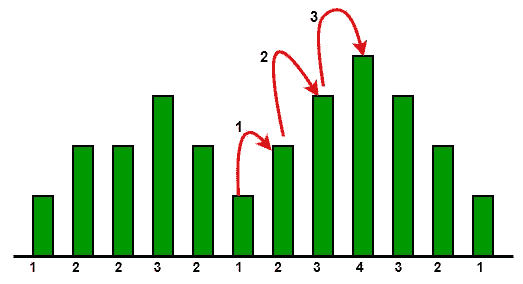

# 连续步骤到屋顶

> 原文： [https://www.geeksforgeeks.org/roof-top/](https://www.geeksforgeeks.org/roof-top/)

给定连续建筑物的高度，找到一个人可以提出的最大连续台阶数，这样他从一栋建筑物的屋顶转到下一栋相邻建筑物的屋顶时，高度会增加。
 **范例：**

```
Input : arr[] = {1, 2, 2, 3, 2}
Output : 1
Explanation :
Maximum consecutive steps from 1 to 2 OR  2 to 3.

Input : arr[] = {1, 2, 3, 4}
Output : 3

```

## [推荐：请先在“ ***<u>实践</u>*** ”上解决它，然后再继续解决。](https://practice.geeksforgeeks.org/problems/roof-top/0)



此问题基本上是[最长递增子数组](https://www.geeksforgeeks.org/longest-increasing-subarray/)的变体

方法：

```
initialize count = 0
initialize maximum = 0
    if arr[i]>a[i-1]
then count increment
    else
maximum = max(maximum, count)

at the end maximum=max(maximum, count)

```

## C ++

```

// CPP code to find maximum  
// number of consecutive steps. 
#include <bits/stdc++.h> 
using namespace std; 

// Function to count consecutive steps 
int find_consecutive_steps(int arr[], int len) 
{ 
    int count = 0; 
    int maximum = 0; 

    for (int index = 1; index < len; index++) { 

        // count the number of consecutive  
        // increasing height building 
        if (arr[index] > arr[index - 1]) 
            count++; 
        else
        { 
            maximum = max(maximum, count); 
            count = 0; 
        } 
    } 

    return max(maximum, count);     
} 

// Driver code 
int main() 
{ 
    int arr[] = { 1, 2, 3, 4 }; 
    int len = sizeof(arr) / sizeof(arr[0]); 

    cout << find_consecutive_steps(arr, len); 
} 

```

## 爪哇

```

// Java code to find maximum  
// number of consecutive steps. 
import java.io.*; 

class GFG { 

    // Function to count consecutive steps 
    static int find_consecutive_steps(int arr[], 
                                        int len) 
    { 
        int count = 0; 
        int maximum = 0; 

        for (int index = 1; index < len; index++) { 

            // count the number of consecutive  
            // increasing height building 
            if (arr[index] > arr[index - 1]) 
                count++; 
            else
            { 
                maximum = Math.max(maximum, count); 
                count = 0; 
            } 
        } 

        return Math.max(maximum, count);  
    } 

    // Driver code 
    public static void main (String[] args) { 

        int arr[] = { 1, 2, 3, 4 }; 
        int len = arr.length; 

        System.out.println(find_consecutive_steps(arr, 
                                                len)); 
    } 
} 

// This code is contributed by Gitanjali. 

```

## Python3

```

# Python3 code to find maximum  
# number of consecutive steps 
import math 

# Function to count consecutive steps 
def find_consecutive_steps(arr, len): 

    count = 0; maximum = 0

    for index in range(1, len): 

        # count the number of consecutive  
        # increasing height building 
        if (arr[index] > arr[index - 1]): 
            count += 1

        else: 
            maximum = max(maximum, count) 
            count = 0

    return max(maximum, count) 

# Driver code 
arr = [ 1, 2, 3, 4 ] 
len = len(arr) 
print(find_consecutive_steps(arr, len)) 

# This code is contributed by Gitanjali. 

```

## C＃

```

// C# code to find maximum  
// number of consecutive steps. 
using System; 

class GFG { 

    // Function to count consecutive steps 
    static int find_consecutive_steps(int []arr, 
                                        int len) 
    { 
        int count = 0; 
        int maximum = 0; 

        for (int index = 1; index < len; index++) { 

            // count the number of consecutive  
            // increasing height building 
            if (arr[index] > arr[index - 1]) 
                count++; 
            else
            { 
                maximum = Math.Max(maximum, count); 
                count = 0; 
            } 
        } 

        return Math.Max(maximum, count);  
    } 

    // Driver code 
    public static void Main () { 

        int []arr = { 1, 2, 3, 4 }; 
        int len = arr.Length; 

        Console.WriteLine(find_consecutive_steps(arr, 
                                                len)); 
    } 
} 

// This code is contributed by vt_m. 

```

## 的 PHP

```

<?php 
// PHP code to find maximum  
// number of consecutive steps. 

// Function to count 
// consecutive steps 
function find_consecutive_steps($arr,  
                                $len) 
{ 
    $count = 0; 
    $maximum = 0; 

    for ($index = 1; $index < $len;  
                          $index++)  
    { 

        // count the number of consecutive  
        // increasing height building 
        if ($arr[$index] > $arr[$index - 1]) 
            $count++; 
        else
        { 
            $maximum = max($maximum, $count); 
            $count = 0; 
        } 
    } 

    return max($maximum, $count);  
} 

// Driver code 
$arr = array( 1, 2, 3, 4 ); 
$len = count($arr); 

echo find_consecutive_steps($arr, $len); 

// This code is contributed by vt_m.  
?> 

```

 **输出：**

```
3

```

现在不要停下来，将您的学习提高到一个新的水平。 借助最受信任的课程，学习数据结构和算法的所有重要概念： [DSA Self Paced](https://practice.geeksforgeeks.org/courses/dsa-self-paced?utm_source=geeksforgeeks&utm_medium=article&utm_campaign=gfg_article_dsa_content_bottom) 。 以对学生友好的价格准备好行业。

* * *

* * *

如果您喜欢 GeeksforGeeks 并希望做出贡献，则还可以使用 [tribution.geeksforgeeks.org](https://contribute.geeksforgeeks.org/) 撰写文章，或将您的文章邮寄至 tribution@geeksforgeeks.org。 查看您的文章出现在 GeeksforGeeks 主页上，并帮助其他 Geeks。

如果您发现任何不正确的地方，请单击下面的“改进文章”按钮，以改进本文。