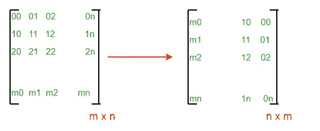

# 将图像旋转 90 度

> 原文： [https://www.geeksforgeeks.org/turn-an-image-by-90-degree/](https://www.geeksforgeeks.org/turn-an-image-by-90-degree/)

给定图像，如何将其旋转 90 度？ 一个模糊的问题。 最小化浏览器，然后尝试进一步解决方案。

图像可以视为 2D 矩阵，可以存储在缓冲区中。 我们提供了矩阵尺寸及其基地址。 我们怎么能转呢？

例如，见下图，

```
* * * ^ * * *
* * * | * * *
* * * | * * *
* * * | * * *
```

向右旋转后，它会出现（观察箭头方向）

```
* * * *
* * * *
* * * *
-- - - >
* * * *
* * * *
* * * *
```

这个想法很简单。 将源矩阵的每一行转换为最终图像所需的列。 我们将使用辅助缓冲区来转换图像。

从上图可以看出

```
first row of source ------> last column of destination
second row of source ------> last but-one column of destination
so ... on
last row of source ------> first column of destination
```

以图片的形式，我们可以表示（m x n）矩阵到（n x m）矩阵的上述转换，



转变

如果您尚未尝试，请立即尝试使用伪代码。

编写伪代码很容易。 在 C / C ++中，我们通常会按行主要顺序遍历矩阵。 每行转换为最终图像的不同列。 我们需要构造最终图像的列。 请参阅以下算法（转换）

```
for (r = 0; r < m; r++)
{
   for (c = 0; c < n; c++)
   {
      // Hint: Map each source element indices into
      // indices of destination matrix element.
       dest_buffer [ c ] [ m - r - 1 ] = source_buffer [ r ] [ c ];
   }
}
```

请注意，有多种方法可以基于矩阵，行主要或列主要顺序的遍历来实现算法。 我们有两个矩阵和两种方式（行和列主行）遍历每个矩阵。 因此，至少有 4 种不同的方式将源矩阵转换为最终矩阵。

## [推荐：在继续进行解决之前，请先在 ***<u>{IDE}</u>*** 上尝试您的方法。](https://ide.geeksforgeeks.org/)

## C ++

```

// C++ program to turn an  
// image by 90 Degree  
#include <bits/stdc++.h> 
using namespace std; 
void displayMatrix(unsigned int const *p,  
                    unsigned int row,  
                   unsigned int col);  

void rotate(unsigned int *pS,  
            unsigned int *pD,  
            unsigned int row,  
            unsigned int col);  

void displayMatrix(unsigned int const *p,  
                   unsigned int r,  
                   unsigned int c)  
{  
    unsigned int row, col;  
    cout << "\n\n";  

    for (row = 0; row < r; row++)  
    {  
        for (col = 0; col < c; col++)  
            cout << * (p + row * c + col) << "\t";  
        cout << "\n";  
    }  

    cout << "\n\n";  
}  

void rotate(unsigned int *pS,  
            unsigned int *pD,  
            unsigned int row,  
            unsigned int col)  
{  
    unsigned int r, c;  
    for (r = 0; r < row; r++)  
    {  
        for (c = 0; c < col; c++)  
        {  
            *(pD + c * row + (row - r - 1)) =  
                        *(pS + r * col + c);  
        }  
    }  
}  

// Driver Code  
int main()  
{  

    // declarations  
    unsigned int image[][4] = {{1, 2, 3, 4},  
                               {5, 6, 7, 8},  
                               {9, 10, 11, 12}};  
    unsigned int *pSource;  
    unsigned int *pDestination;  
    unsigned int m, n;  

    // setting initial values  
    // and memory allocation  
    m = 3, n = 4, pSource = (unsigned int *)image;  
    pDestination = (unsigned int *)malloc
                   (sizeof(int) * m * n);  

    // process each buffer  
    displayMatrix(pSource, m, n);  

    rotate(pSource, pDestination, m, n);  

    displayMatrix(pDestination, n, m);  

    free(pDestination);  

    return 0;  
}  

// This code is contributed by rathbhupendra 

```

## C

```

// C program to turn an  
// image by 90 Degree 
#include <stdio.h> 
#include <stdlib.h> 

void displayMatrix(unsigned int const *p,  
                   unsigned int row,  
                   unsigned int col); 

void rotate(unsigned int *pS,  
            unsigned int *pD,  
            unsigned int row,  
            unsigned int col); 

void displayMatrix(unsigned int const *p,  
                   unsigned int r,  
                   unsigned int c)  
{ 
    unsigned int row, col; 
    printf("\n\n"); 

    for (row = 0; row < r; row++) 
    { 
        for (col = 0; col < c; col++) 
            printf("%d\t", * (p + row * c + col)); 
        printf("\n"); 
    } 

    printf("\n\n"); 
} 

void rotate(unsigned int *pS,  
            unsigned int *pD, 
            unsigned int row,  
            unsigned int col) 
{ 
    unsigned int r, c; 
    for (r = 0; r < row; r++) 
    { 
        for (c = 0; c < col; c++) 
        { 
            *(pD + c * row + (row - r - 1)) =  
                            *(pS + r * col + c); 
        } 
    } 
} 

// Driver Code 
int main() 
{ 

    // declarations 
    unsigned int image[][4] = {{1,2,3,4},  
                               {5,6,7,8}, 
                               {9,10,11,12}}; 
    unsigned int *pSource; 
    unsigned int *pDestination; 
    unsigned int m, n; 

    // setting initial values 
    // and memory allocation 
    m = 3, n = 4, pSource = (unsigned int *)image; 
    pDestination =  
        (unsigned int *)malloc 
        (sizeof(int) * m * n); 

    // process each buffer 
    displayMatrix(pSource, m, n); 

    rotate(pSource, pDestination, m, n); 

    displayMatrix(pDestination, n, m); 

    free(pDestination); 

    getchar(); 
    return 0; 
} 

```

输出：

```

1    2    3    4    
5    6    7    8    
9    10    11    12    

9    5    1    
10    6    2    
11    7    3    
12    8    4    

```

[将方形矩阵旋转 90 度](https://www.geeksforgeeks.org/inplace-rotate-square-matrix-by-90-degrees/)

由 **[Venki](https://www.geeksforgeeks.org/?page_id=2)** 编译。 如果发现任何不正确的地方，或者想分享有关上述主题的更多信息，请写评论。

现在不要停下来，将您的学习提高到一个新的水平。 借助最受信任的课程，学习数据结构和算法的所有重要概念： [DSA Self Paced](https://practice.geeksforgeeks.org/courses/dsa-self-paced?utm_source=geeksforgeeks&utm_medium=article&utm_campaign=gfg_article_dsa_content_bottom) 。 以对学生友好的价格准备好行业。