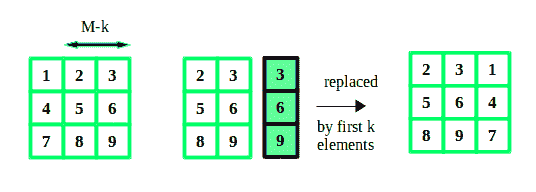

# 向右旋转矩阵 K 次

> 原文： [https://www.geeksforgeeks.org/rotate-matrix-right-k-times/](https://www.geeksforgeeks.org/rotate-matrix-right-k-times/)

给定一个大小为 N * M 且值为 K 的矩阵。我们必须将矩阵向右旋转 K 次。

**示例**：

```
Input :  N = 3, M = 3, K = 2
         12 23 34
         45 56 67
         78 89 91 

Output : 23 34 12
         56 67 45
         89 91 78 

Input :  N = 2, M = 2, K = 2
         1 2
         3 4

Output : 1 2
         3 4

```

> [推荐：在继续进行解决之前，请先在 ***{IDE}*** 上尝试您的方法。](https://ide.geeksforgeeks.org/)

一种简单而有效的方法是将矩阵的每一行视为一个数组并执行数组旋转。 可以通过使用临时数组将元素从 K 复制到数组的末尾到数组的开头来完成。 然后剩下的元素从开始到 K-1 到结束。

让我们举个例子：


## C++ 

```

// CPP program to rotate a matrix right by k times 
#include <iostream> 

// size of matrix 
#define M 3 
#define N 3 

using namespace std; 

// function to rotate matrix by k times 
void rotateMatrix(int matrix[][M], int k) { 
  // temporary array of size M 
  int temp[M]; 

  // within the size of matrix 
  k = k % M; 

  for (int i = 0; i < N; i++) { 

    // copy first M-k elements to temporary array 
    for (int t = 0; t < M - k; t++) 
      temp[t] = matrix[i][t]; 

    // copy the elements from k to end to starting 
    for (int j = M - k; j < M; j++) 
      matrix[i][j - M + k] = matrix[i][j]; 

    // copy elements from temporary array to end 
    for (int j = k; j < M; j++) 
      matrix[i][j] = temp[j - k]; 
  } 
} 

// function to display the matrix 
void displayMatrix(int matrix[][M]) { 
  for (int i = 0; i < N; i++) { 
    for (int j = 0; j < M; j++) 
      cout << matrix[i][j] << " "; 
    cout << endl; 
  } 
} 

// Driver's code 
int main() { 
  int matrix[N][M] = {{12, 23, 34}, 
                     {45, 56, 67},  
                     {78, 89, 91}}; 
  int k = 2; 

  // rotate matrix by k 
  rotateMatrix(matrix, k); 

  // display rotated matrix 
  displayMatrix(matrix); 

  return 0; 
} 

```