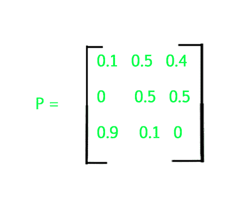

# 马尔可夫矩阵程序

> 原文： [https://www.geeksforgeeks.org/markov-matrix/](https://www.geeksforgeeks.org/markov-matrix/)

给定一个 m x n 2D 矩阵，请检查它是否为马尔可夫矩阵。

**马尔可夫矩阵：**每行总和等于 1 的矩阵。



马尔可夫矩阵的例子

**示例：**

```
Input :
1    0   0
0.5  0  0.5
0    0   1
Output : yes

Explanation :
Sum of each row results to 1, 
therefore it is a Markov Matrix.

Input :
1 0 0
0 0 2
1 0 0
Output :
no

```

## [推荐：在继续进行解决之前，请先在 ***<u>{IDE}</u>*** 上尝试您的方法。](https://ide.geeksforgeeks.org/)

**方法：**初始化一个 2D 数组，然后使用另一个一维数组存储矩阵的每一行的总和，并检查存储在此 1D 数组中的所有总和是否等于 1，如果是，则它 是马尔可夫矩阵，否则不是。

## C ++

```

// C++ code to check Markov Matrix 
#include <iostream> 
using namespace std; 

#define n 3 

bool checkMarkov(double m[][n]) 
{ 
    // outer loop to access rows 
    // and inner to access columns 
    for (int i = 0; i <n; i++) { 

        // Find sum of current row 
        double sum = 0; 
        for (int j = 0; j < n; j++) 
            sum = sum + m[i][j]; 

        if (sum != 1) 
        return false; 
    } 

    return true; 
} 

// Driver Code 
int main()  
{ 
    // Matrix to check 
    double m[3][3] = { { 0, 0, 1 }, 
                    { 0.5, 0, 0.5 }, 
                    { 1, 0, 0 } }; 

    // calls the function check() 
    if (checkMarkov(m)) 
        cout << " yes "; 
    else
        cout << " no "; 
} 

// This code is contributed by Anant Agarwal. 

```