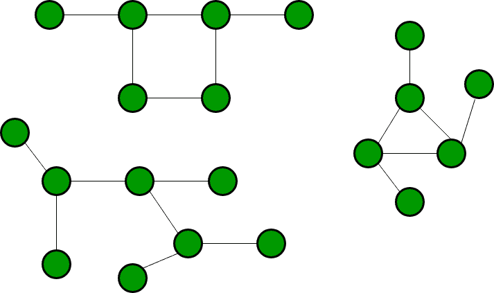
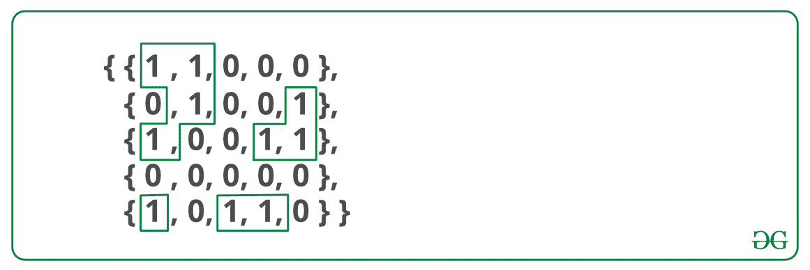

# 查找岛屿数| 系列 1（使用 DFS）

> 原文： [https://www.geeksforgeeks.org/find-number-of-islands/](https://www.geeksforgeeks.org/find-number-of-islands/)

给定布尔 2D 矩阵，找到孤岛的数量。 一组相连的 1 组成一个岛。 例如，下面的矩阵包含 5 个岛

**示例**：

```
Input : mat[][] = {{1, 1, 0, 0, 0},
                   {0, 1, 0, 0, 1},
                   {1, 0, 0, 1, 1},
                   {0, 0, 0, 0, 0},
                   {1, 0, 1, 0, 1} 
Output : 5

```

这是标准问题的变体：“计算无向图中的已连接组件数”。

在解决问题之前，让我们了解什么是连接的组件。 无向图的[连接组件](https://www.geeksforgeeks.org/connected-components-in-an-undirected-graph/)是子图，其中每两个顶点通过一条路径相互连接，并且不与子图外部的其他顶点连接。
例如，下面的图形具有三个连接的组件。



> [推荐：请先在“ ***实践*** ”上解决它，然后再继续解决。](https://practice.geeksforgeeks.org/problems/find-the-number-of-islands/1)

所有顶点相互连接的图具有一个完整的连接组件，该组件由整个图组成。 这样的仅具有一个连接组件的图称为强连接图。

通过在每个组件上应用 DFS（）可以轻松解决该问题。 在每个 DFS（）调用中，都会访问组件或子图。 我们将在下一个未访问的组件上调用 DFS。 调用 DFS（）的次数给出了已连接组件的数量。 也可以使用 BFS。

***什么是岛屿？***
一组相连的 1s 形成一个岛。 例如，下面的矩阵包含 4 个岛



## [Recommended: Please solve it on “***PRACTICE***” first, before moving on to the solution.](https://practice.geeksforgeeks.org/problems/find-the-number-of-islands/1)

2D 矩阵中的一个单元可以连接到 8 个邻居。 因此，与标准 DFS（）不同，在该标准中我们递归地调用所有相邻的顶点，而在这里我们只能递归地调用 8 个邻居。 我们会跟踪已访问的 1，以便不再对其进行访问。

## C++ 

```cpp

// C++ Program to count islands in boolean 2D matrix 
#include <bits/stdc++.h> 
using namespace std; 

#define ROW 5 
#define COL 5 

// A function to check if a given 
// cell (row, col) can be included in DFS 
int isSafe(int M[][COL], int row, int col, 
           bool visited[][COL]) 
{ 
    // row number is in range, column 
    // number is in range and value is 1 
    // and not yet visited 
    return (row >= 0) && (row < ROW) && (col >= 0) && (col < COL) && (M[row][col] && !visited[row][col]); 
} 

// A utility function to do DFS for a 
// 2D boolean matrix. It only considers 
// the 8 neighbours as adjacent vertices 
void DFS(int M[][COL], int row, int col, 
         bool visited[][COL]) 
{ 
    // These arrays are used to get 
    // row and column numbers of 8 
    // neighbours of a given cell 
    static int rowNbr[] = { -1, -1, -1, 0, 0, 1, 1, 1 }; 
    static int colNbr[] = { -1, 0, 1, -1, 1, -1, 0, 1 }; 

    // Mark this cell as visited 
    visited[row][col] = true; 

    // Recur for all connected neighbours 
    for (int k = 0; k < 8; ++k) 
        if (isSafe(M, row + rowNbr[k], col + colNbr[k], visited)) 
            DFS(M, row + rowNbr[k], col + colNbr[k], visited); 
} 

// The main function that returns 
// count of islands in a given boolean 
// 2D matrix 
int countIslands(int M[][COL]) 
{ 
    // Make a bool array to mark visited cells. 
    // Initially all cells are unvisited 
    bool visited[ROW][COL]; 
    memset(visited, 0, sizeof(visited)); 

    // Initialize count as 0 and 
    // travese through the all cells of 
    // given matrix 
    int count = 0; 
    for (int i = 0; i < ROW; ++i) 
        for (int j = 0; j < COL; ++j) 

            // If a cell with value 1 is not 
            if (M[i][j] && !visited[i][j]) { 
                // visited yet, then new island found 
                // Visit all cells in this island. 
                DFS(M, i, j, visited); 

                // and increment island count 
                ++count; 
            } 

    return count; 
} 

// Driver code 
int main() 
{ 
    int M[][COL] = { { 1, 1, 0, 0, 0 }, 
                     { 0, 1, 0, 0, 1 }, 
                     { 1, 0, 0, 1, 1 }, 
                     { 0, 0, 0, 0, 0 }, 
                     { 1, 0, 1, 0, 1 } }; 

    cout << "Number of islands is: " << countIslands(M); 

    return 0; 
} 

// This is code is contributed by rathbhupendra 

```