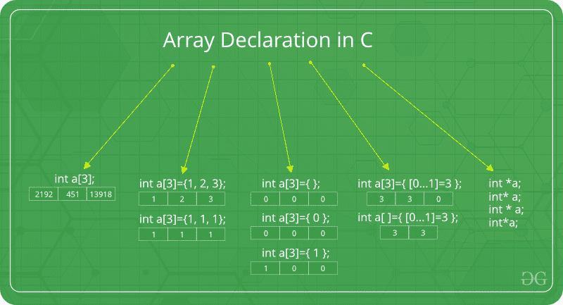
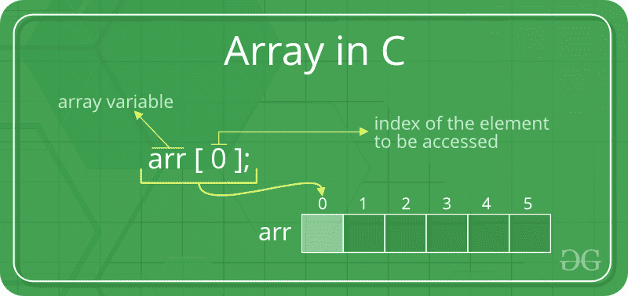

# C/C++ 中的数组

> 原文： [https://www.geeksforgeeks.org/arrays-in-c-language-set-1-introduction/](https://www.geeksforgeeks.org/arrays-in-c-language-set-1-introduction/)

C 或 C++ 中的数组是存储在连续内存位置的项目的集合，可以使用数组的索引随机访问元素。 它们用于存储相似类型的元素，因为所有元素的数据类型必须相同。 它们可用于存储原始数据类型的集合，例如任何特定类型的`int`，`float`，`double`，`char`等。 另外，使用 C 或 C++ 的数组可以存储派生的数据类型，例如结构，指针等。下面给出的是数组的如画表示。

[](https://media.geeksforgeeks.org/wp-content/cdn-uploads/gq/2015/05/Arrays.png)

**为什么需要数组？**
当我们有少量对象时，我们可以使用普通变量（`v1`，`v2`，`v3`，..），但是如果我们要存储大量实例，则很难用普通变量来管理它们 变量。 数组的想法是在一个变量中表示许多实例。

**C/C++ 中的数组声明：**


我们可以通过多种方式声明数组。 可以通过指定其类型和大小，对其进行初始化或同时对两者进行初始化来完成。

1.  **通过指定大小**

    ```

    // Array declaration by specifying size 
    int arr1[10]; 

    // With recent C/C++ versions, we can also 
    // declare an array of user specified size 
    int n = 10; 
    int arr2[n]; 

    ```

    声明数组
2.  **通过初始化元素**

    ```

    // Array declaration by initializing elements 
    int arr[] = { 10, 20, 30, 40 } 

    // Compiler creates an array of size 4\. 
    // above is same as  "int arr[4] = {10, 20, 30, 40}" 

    ```

    进行数组声明
3.  **通过指定大小和初始化元素来声明数组**

    ```

    // Array declaration by specifying size and initializing 
    // elements 
    int arr[6] = { 10, 20, 30, 40 } 

    // Compiler creates an array of size 6, initializes first 
    // 4 elements as specified by user and rest two elements as 0\. 
    // above is same as  "int arr[] = {10, 20, 30, 40, 0, 0}" 

    ```

**C/C++ 中的数组的优点：**

1.  使用数组索引随机访问元素。
2.  使用较少的代码行，因为它创建了多个元素的单个数组。
3.  轻松访问所有元素。
4.  使用单个循环，遍历数组变得容易。
5.  排序变得很容易，因为可以通过编写更少的代码行来实现。

**C/C++ 中的数组的缺点：**

1.  允许输入在声明时确定的固定数量的元素。 与链接列表不同，C 中的数组不是动态的。
2.  元素的插入和删除可能很昂贵，因为需要根据新的内存分配来管理元素。

**关于 C/C++ 中的数组的事实：**

*   **Accessing Array Elements:**
    Array elements are accessed by using an integer index. Array index starts with 0 and goes till size of array minus 1.
    

    **示例：**

    ## C

    ```

    #include <stdio.h> 

    int main() 
    { 
        int arr[5]; 
        arr[0] = 5; 
        arr[2] = -10; 
        arr[3 / 2] = 2; // this is same as arr[1] = 2 
        arr[3] = arr[0]; 

        printf("%d %d %d %d", arr[0], arr[1], arr[2], arr[3]); 

        return 0; 
    } 

    ```