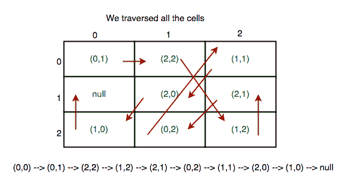

# 通过遵循单元格值来查找二维数组是否被完全遍历

> 原文： [https://www.geeksforgeeks.org/find-2-d-array-completely-traversed-not-following-cell-values/](https://www.geeksforgeeks.org/find-2-d-array-completely-traversed-not-following-cell-values/)

您将获得一个二维数组。 我们必须遵循单元格位置遍历给定数组的每个单元格，然后返回 true 或 false。 每个单元格的值由（x，y）给出，其中（x，y）也显示接下来的下一个单元格位置。 例如。 （0，0）显示起始单元格。 “空”表示遍历每个单元格后的最终目的地。


**示例**：

```
Input : { 0, 1   1, 2   1, 1 
          0, 2   2, 0   2, 1 
          0, 0   1, 0   null }
Output : false

Input : { 0, 1   2, 0 
          null  1, 0
          2, 1   1, 1 }
Output : true

```


如果访问一个单元格，则采用一个访问数组，然后在访问数组中将其值设为 true，以便下次再次访问它时可以捕获网格中的循环。 而且，如果我们在完成循环之前发现 null，则意味着我们没有遍历给定数组的所有单元格。

## Java

```java

/* Java program to Find a 2-D array is completely 
traversed or not by following the cell values */
import java.io.*; 

class Cell { 
    int x; 
    int y; 

    // Cell class constructor 
    Cell(int x, int y) 
    { 
        this.x = x; 
        this.y = y; 
    } 
} 

public class MoveCellPerCellValue { 

    // function which tells all cells are visited or not 
    public boolean isAllCellTraversed(Cell grid[][]) 
    { 
        boolean[][] visited =  
              new boolean[grid.length][grid[0].length]; 

        int total = grid.length * grid[0].length; 
        // starting cell values 
        int startx = grid[0][0].x; 
        int starty = grid[0][0].y; 

        for (int i = 0; i < total - 2; i++) { 

            // if we get null before the end of loop  
            // then returns false. Because it means we  
            // didn't traverse all the cells 
            if (grid[startx][starty] == null)  
                return false; 

            // If found cycle then return false 
            if (visited[startx][starty] == true)  
                return false; 

            visited[startx][starty] = true; 
            int x = grid[startx][starty].x; 
            int y = grid[startx][starty].y; 

            // Update startx and starty values to next 
            // cell values 
            startx = x; 
            starty = y; 
        } 

        // finally if we reach our goal then returns true 
        if (grid[startx][starty] == null)  
            return true; 

        return false; 
    } 

    /* Driver program to test above function */
    public static void main(String args[]) 
    { 
        Cell cell[][] = new Cell[3][2]; 
        cell[0][0] = new Cell(0, 1); 
        cell[0][1] = new Cell(2, 0); 
        cell[1][0] = null; 
        cell[1][1] = new Cell(1, 0); 
        cell[2][0] = new Cell(2, 1); 
        cell[2][1] = new Cell(1, 1); 

        MoveCellPerCellValue mcp = new MoveCellPerCellValue(); 
        System.out.println(mcp.isAllCellTraversed(cell)); 
    } 
} 

```