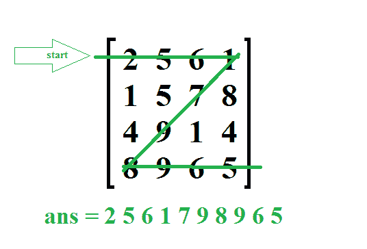

# 程序以 Z 格式打印矩阵

> 原文： [https://www.geeksforgeeks.org/program-print-matrix-z-form/](https://www.geeksforgeeks.org/program-print-matrix-z-form/)

给定 n * n 阶方阵，我们需要以 Z 形式打印矩阵的元素

```
Examples:
Input : mat[][] =  {1, 2, 3,
                    4, 5, 6,
                    7, 8, 9}
Output : 1 2 3 5 7 8 9

Input : mat[][] = {5, 19, 8, 7,
                   4, 1, 14, 8,
                   2, 20, 1, 9,
                   1, 2, 55, 4}
Output: 5 19 8 7 14 20 1 2 55 4

```


复杂度`O(n)`


我们需要遍历矩阵的第一行，然后遍历第二对角线，然后遍历最后一行。

## CPP

```

// CPP program to print a square matrix in Z form 
#include <bits/stdc++.h> 
using namespace std; 
const int MAX = 100; 

// Function to print a square matrix in Z form 
void printZform(int mat[][MAX], int n) 
{ 
    // print first row 
    for (int i = 0; i < n; i++) 
        cout << mat[0][i] << " "; 

    // Print diagonal 
    int i = 1, j = n - 2; 
    while (i < n && j >= 0) // print diagonal 
    { 
        cout << mat[i][j] << " "; 
        i++; 
        j--; 
    } 

    // Print last row 
    for (int i = 1; i < n; i++) 
        cout << mat[n - 1][i] << " "; 
} 

// Driver function 
int main() 
{ 
    int mat[][MAX] = { { 4, 5, 6, 8 }, 
                       { 1, 2, 3, 1 }, 
                       { 7, 8, 9, 4 }, 
                       { 1, 8, 7, 5 } }; 
    printZform(mat, 4); 
    return 0; 
} 

```

## Java

```java

// Java program to print a 
// square matrix in Z form 

import java.lang.*; 
import java.io.*; 

class GFG { 
    public static void diag(int arr[][], int n) 
    { 
        int i = 0, j, k; 

        // print first row 
        for (j = 0; j < n - 1; j++) { 
            System.out.print(arr[i][j] + " "); 
        } 

        // Print diagonal 
        k = 1; 
        for (i = 0; i < n - 1; i++) { 
            for (j = 0; j < n; j++) { 
                if (j == n - k) { 
                    System.out.print(arr[i][j] + " "); 
                    break; 
                } 
            } 
            k++; 
        } 
        // Print last row 
        i = n - 1; 
        for (j = 0; j < n; j++) 
            System.out.print(arr[i][j] + " "); 

        System.out.print("\n"); 
    } 

    public static void main(String[] args) 
    { 
        int a[][] = { { 4, 5, 6, 8 }, 
                      { 1, 2, 3, 1 }, 
                      { 7, 8, 9, 4 }, 
                      { 1, 8, 7, 5 } }; 

        diag(a, 4); 
    } 
} 

// Code contributed by Mohit Gupta_OMG <(0_o)> 

```

## Python3

```py

# Python program to print a  
# square matrix in Z form 

arr = [[4, 5, 6, 8],  
        [1, 2, 3, 1],  
        [7, 8, 9, 4],  
        [1, 8, 7, 5]] 

n = len(arr[0]) 

i = 0
for j in range(0, n-1): 
    print(arr[i][j], end = ' ')  

k = 1
for i in range(0, n): 
    for j in range(n, 0, -1): 
        if(j == n-k): 
            print(arr[i][j], end = ' ')  
            break;  
    k+= 1

# Print last row 
i = n-1;  
for j in range(0, n): 
    print(arr[i][j], end = ' ') 

# Code contributed by Mohit Gupta_OMG <(0_o)> 

```

## C# 

```cs

// C# program to print a square  
// matrix in Z form 
using System; 

class GFG { 

    public static void printZform(int[, ] mat, int n) 
    { 

        int i, j; 

        // print first row 
        for (i = 0; i < n; i++) { 
            Console.Write(mat[0, i] + " "); 
        } 

        // Print diagonal 
        i = 1; 
        j = n - 2; 

        while (i < n && j >= 0) // print diagonal 
        { 
            Console.Write(mat[i,j] + " "); 
            i++; 
            j--; 
        } 

        // Print last row 
        for (i = 1; i < n; i++) 
            Console.Write(mat[n - 1,i] + " "); 
    } 

    // Driver code 
    public static void Main() 
    { 
        int[, ] mat = { { 4, 5, 6, 8 }, 
                    { 1, 2, 3, 1 }, 
                    { 7, 8, 9, 4 }, 
                    { 1, 8, 7, 5 } }; 

        printZform(mat, 4); 
    } 
} 

// This code is contributed by vt_m. 

```

## PHP

```php

<?php 
// PHP program to print a  
// square matrix in Z form 

$MAX = 100; 

// Function to print a  
// square matrix in Z form 
function printZform( $mat, $n) 
{ 

    // print first row 
    for($i = 0; $i < $n; $i++) 
        echo $mat[0][$i] , " "; 

    // Print diagonal 
    $i = 1;$j = $n - 2; 

    // print diagonal 
    while ($i < $n and $j >= 0)  
    { 
        echo $mat[$i][$j] , " "; 
        $i++; 
        $j--; 
    } 

    // Print last row 
    for ( $i = 1; $i < $n; $i++) 
        echo $mat[$n - 1][$i] , " "; 
} 

    // Driver Code 
    $mat = array(array(4, 5, 6, 8), 
                 array(1, 2, 3, 1), 
                 array(7, 8, 9, 4), 
                 array(1, 8, 7, 5)); 
    printZform($mat, 4); 

// This code is contributed by anuj_67\. 
?> 

```

**输出**：

```
4 5 6 8 3 8 1 8 7 5

```

**替代的简单实现**：
感谢 [Aathishithan](https://auth.geeksforgeeks.org/user/Aathishithan) 提出了这一建议。

```

// Java program to print a  
// square matrix in Z form  

import java.lang.*;  
import java.io.*;  

class GFG {  
    public static void diag(int arr[][], int n)  
    {  
        int i = 0, j, k;  
        for(i = 0;i < n;i++){ 
           for(j = 0;j < n;j++){ 
              if(i == 0){ 
                System.out.print(arr[i][j]+" "); 
              } else if(i == j){ 
                   System.out.print(arr[i][j]+" "); 
              } else if(i == n-1){ 
                   System.out.print(arr[i][j]+" "); 
              } 
           } 
        } 

    }  

    public static void main(String[] args)  
    {  
        int a[][] = { { 4, 5, 6, 8 },  
                    { 1, 2, 3, 1 },  
                    { 7, 8, 9, 4 },  
                    { 1, 8, 7, 5 } };  

        diag(a, 4);  
    }  
}  

```

**输出**：

```
4 5 6 8 2 9 1 8 7 5

```

