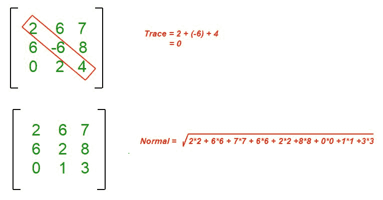

# 查找矩阵的法线和迹线的程序

> 原文： [https://www.geeksforgeeks.org/program-find-normal-trace-matrix/](https://www.geeksforgeeks.org/program-find-normal-trace-matrix/)

给定 2D 矩阵，任务是找到矩阵的“迹线”和“法线”。

**矩阵的标准**定义为矩阵元素平方和的平方根。

n×n 方阵的 [**迹线**](https://en.wikipedia.org/wiki/Trace_(linear_algebra)) 是对角元素的总和。

**示例：**

```
Input : mat[][] = {{7, 8, 9},
                   {6, 1, 2},
                   {5, 4, 3}};
Output : Normal = 16  
         Trace  = 11
Explanation : 
Normal = sqrt(7*7+ 8*8 + 9*9 + 6*6 +
              1*1 + 2*2 + 5*5 + 4*4 + 3*3)   
       = 16
Trace  = 7+1+3 = 11

Input :mat[][] = {{1, 2, 3},
                  {6, 4, 5},
                  {2, 1, 3}};
Output : Normal = 10  
         Trace = 8
Explanation : 
Normal = sqrt(1*1 +2*2 + 3*3 + 6*6 + 4*4 + 
             5*5 + 2*2 + 1*1 + 3*3)   
Trace = 8(1+4+3)

```

## [推荐：在继续进行解决之前，请先在 ***<u>{IDE}</u>*** 上尝试您的方法。](https://ide.geeksforgeeks.org/)



## C++ 

```

// C++ program to find trace and normal 
// of given matrix 
#include<bits/stdc++.h> 
using namespace std; 

// Size of given matrix 
const int MAX = 100; 

// Returns Normal of a matrix of size n x n 
int findNormal(int mat[][MAX], int n) 
{ 
    int sum = 0; 
    for (int i=0; i<n; i++) 
        for (int j=0; j<n; j++) 
            sum += mat[i][j]*mat[i][j]; 
    return sqrt(sum); 
} 

// Returns trace of a matrix of size n x n 
int findTrace(int mat[][MAX], int n) 
{ 
    int sum = 0; 
    for (int i=0; i<n; i++) 
         sum += mat[i][i]; 
    return sum; 
} 

// Driven source 
int main() 
{ 
    int mat[][MAX] = {{1, 1, 1, 1, 1}, 
        {2, 2, 2, 2, 2}, 
        {3, 3, 3, 3, 3}, 
        {4, 4, 4, 4, 4}, 
        {5, 5, 5, 5, 5}, 
    }; 
    cout << "Trace of Matrix = "
         << findTrace(mat, 5) << endl; 
    cout << "Normal of Matrix = "
         << findNormal(mat, 5) << endl; 
    return 0; 
} 

```

## 爪哇

```

// Java program to find trace and normal 
// of given matrix 

import java.io.*; 

class GFG { 

// Size of given matrix 
static  int MAX = 100; 

// Returns Normal of a matrix of size n x n 
 static int findNormal(int mat[][], int n) 
{ 
    int sum = 0; 
    for (int i=0; i<n; i++) 
        for (int j=0; j<n; j++) 
            sum += mat[i][j]*mat[i][j]; 
    return (int)Math.sqrt(sum); 
} 

// Returns trace of a matrix of size n x n 
 static int findTrace(int mat[][], int n) 
{ 
    int sum = 0; 
    for (int i=0; i<n; i++) 
        sum += mat[i][i]; 
    return sum; 
} 

// Driven source 
public static void main (String[] args) { 

            int mat[][] = {{1, 1, 1, 1, 1}, 
        {2, 2, 2, 2, 2}, 
        {3, 3, 3, 3, 3}, 
        {4, 4, 4, 4, 4}, 
        {5, 5, 5, 5, 5}, 
    }; 

    System.out.println ("Trace of Matrix = "
         + findTrace(mat, 5)); 
    System.out.println ("Normal of Matrix = "
         + findNormal(mat, 5)); 

    } 
}  

// This code is contributed by vt_m. 

```

## Python3

```

# Python3 program to find trace and  
# normal of given matrix  
import math 

# Size of given matrix  
MAX = 100;  

# Returns Normal of a matrix  
# of size n x n  
def findNormal(mat, n):  

    sum = 0;  
    for i in range(n):  
        for j in range(n):  
            sum += mat[i][j] * mat[i][j];  
    return math.floor(math.sqrt(sum));  

# Returns trace of a matrix of  
# size n x n  
def findTrace(mat, n):  

    sum = 0;  
    for i in range(n):  
        sum += mat[i][i];  
    return sum;  

# Driver Code  
mat = [[1, 1, 1, 1, 1],  
       [2, 2, 2, 2, 2],  
       [3, 3, 3, 3, 3],  
       [4, 4, 4, 4, 4],  
       [5, 5, 5, 5, 5]];  

print("Trace of Matrix =", findTrace(mat, 5));  

print("Normal of Matrix =", findNormal(mat, 5));  

# This code is contributed by mits 

```

## C# 

```

// C# program to find trace and normal 
// of given matrix 
using System; 

class GFG { 

    // Returns Normal of a matrix of 
    // size n x n 
    static int findNormal(int [,]mat, int n) 
    { 
        int sum = 0; 

        for (int i = 0; i < n; i++) 
            for (int j = 0; j < n; j++) 
                sum += mat[i,j] * mat[i,j]; 

        return (int)Math.Sqrt(sum); 
    } 

    // Returns trace of a matrix of size  
    // n x n 
    static int findTrace(int [,]mat, int n) 
    { 
        int sum = 0; 

        for (int i = 0; i < n; i++) 
            sum += mat[i,i]; 

        return sum; 
    } 

    // Driven source 
    public static void Main ()  
    { 
        int [,]mat = { {1, 1, 1, 1, 1}, 
                       {2, 2, 2, 2, 2}, 
                       {3, 3, 3, 3, 3}, 
                       {4, 4, 4, 4, 4}, 
                       {5, 5, 5, 5, 5}, 
    }; 

    Console.Write ("Trace of Matrix = "
            + findTrace(mat, 5) + "\n"); 
    Console.Write("Normal of Matrix = "
                    + findNormal(mat, 5)); 

    } 
}  

// This code is contributed by nitin mittal. 

```

## 的 PHP

```

<?php 
// PHP program to find trace and  
// normal of given matrix 

// Size of given matrix 
$MAX = 100; 

// Returns Normal of a  
// matrix of size n x n 
function findNormal($mat, $n) 
{ 
    $sum = 0; 
    for ( $i = 0; $i < $n; $i++) 
        for ( $j = 0; $j < $n; $j++) 
            $sum += $mat[$i][$j] *  
                    $mat[$i][$j]; 
    return floor(sqrt($sum)); 
} 

// Returns trace of a 
// matrix of size n x n 
function findTrace( $mat, $n) 
{ 
    $sum = 0; 
    for ( $i = 0; $i < $n; $i++) 
        $sum += $mat[$i][$i]; 
    return $sum; 
} 

// Driver Code 
$mat = array(array(1, 1, 1, 1, 1), 
             array(2, 2, 2, 2, 2), 
             array(3, 3, 3, 3, 3), 
             array(4, 4, 4, 4, 4), 
             array(5, 5, 5, 5, 5)); 

echo "Trace of Matrix = ",  
  findTrace($mat, 5),"\n"; 

echo "Normal of Matrix = " ,  
       findNormal($mat, 5) ; 

// This code is contributed by anuj_67\. 
?> 

```

**Output :**

```
Trace of matrix = 15
Normal of matrix = 16

```

 **时间复杂度：** O（n * n）
**空间复杂度：** O（1）

**参考：**
[https://en.wikipedia.org/wiki/Trace_(linear_algebra）](https://en.wikipedia.org/wiki/Trace_(linear_algebra))

本文由 **DANISH_RAZA** 提供。 如果您喜欢 GeeksforGeeks 并希望做出贡献，则也可以使用 [tribution.geeksforgeeks.org](http://www.contribute.geeksforgeeks.org) 撰写文章，或将您的文章邮寄至 tribution@geeksforgeeks.org。 查看您的文章出现在 GeeksforGeeks 主页上，并帮助其他 Geeks。

如果发现任何不正确的地方，或者想分享有关上述主题的更多信息，请写评论。

现在不要停下来，将您的学习提高到一个新的水平。 借助最受信任的课程，学习数据结构和算法的所有重要概念： [DSA Self Paced](https://practice.geeksforgeeks.org/courses/dsa-self-paced?utm_source=geeksforgeeks&utm_medium=article&utm_campaign=gfg_article_dsa_content_bottom) 。 以对学生友好的价格准备好行业。