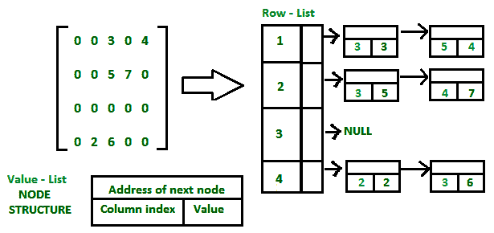

# 稀疏矩阵及其表示| 设置 2（使用列表和键字典）

> 原文： [https://www.geeksforgeeks.org/sparse-matrix-representations-using-list-lists-dictionary-keys/](https://www.geeksforgeeks.org/sparse-matrix-representations-using-list-lists-dictionary-keys/)

先决条件：[稀疏矩阵及其表示集 1（使用数组和链接列表）](https://www.geeksforgeeks.org/sparse-matrix-representation/)

本文讨论了稀疏矩阵表示的其他两种方法。

1.  清单清单
2.  字典

**列表（LIL）**

稀疏矩阵的一种可能表示形式是列表列表（LIL）。 其中一个列表用于表示行，每行包含**三元组的列表：列索引，Value（非零元素）和地址字段，**用于非零元素。 为了获得最佳性能，两个列表均应按升序存储。

[](https://media.geeksforgeeks.org/wp-content/uploads/Sparse-Matrix-List-of-Lists2.png) 

## [推荐：在继续进行解决之前，请先在 ***<u>{IDE}</u>*** 上尝试您的方法。](https://ide.geeksforgeeks.org/)

```

// C program for Sparse Matrix Representation 
// using List Of Lists 
#include<stdio.h> 
#include<stdlib.h> 
#define R 4 
#define C 5 

// Node to represent row - list 
struct row_list 
{ 
    int row_number; 
    struct row_list *link_down; 
    struct value_list *link_right; 
}; 

// Node to represent triples 
struct value_list 
{ 
    int column_index; 
    int value; 
    struct value_list *next; 
}; 

// Function to create node for non - zero elements 
void create_value_node(int data, int j, struct row_list **z) 
{ 
    struct value_list *temp, *d; 

    // Create new node dynamically 
    temp = (struct value_list*)malloc(sizeof(struct value_list)); 
    temp->column_index = j+1; 
    temp->value = data; 
    temp->next = NULL; 

    // Connect with row list 
    if ((*z)->link_right==NULL) 
        (*z)->link_right = temp; 
    else
    { 
        // d points to data list node 
        d = (*z)->link_right; 
        while(d->next != NULL) 
            d = d->next; 
        d->next = temp; 
    } 
} 

// Function to create row list 
void create_row_list(struct row_list **start, int row, 
                    int column, int Sparse_Matrix[R][C]) 
{ 
    // For every row, node is created 
    for (int i = 0; i < row; i++) 
    { 
        struct row_list *z, *r; 

        // Create new node dynamically 
        z = (struct row_list*)malloc(sizeof(struct row_list)); 
        z->row_number = i+1; 
        z->link_down = NULL; 
        z->link_right = NULL; 
        if (i==0) 
            *start = z; 
        else
        { 
            r = *start; 
            while (r->link_down != NULL) 
                r = r->link_down; 
            r->link_down = z; 
        } 

        // Firstiy node for row is created, 
        // and then travering is done in that row 
        for (int j = 0; j < 5; j++) 
        { 
            if (Sparse_Matrix[i][j] != 0) 
            { 
                create_value_node(Sparse_Matrix[i][j], j, &z); 
            } 
        } 
    } 
} 

//Function display data of LIL 
void print_LIL(struct row_list *start) 
{ 
    struct row_list *r; 
    struct value_list *z; 
    r = start; 

    // Traversing row list 
    while (r != NULL) 
    { 
        if (r->link_right != NULL) 
        { 
            printf("row=%d \n", r->row_number); 
            z = r->link_right; 

            // Traversing data list 
            while (z != NULL) 
            { 
                printf("column=%d value=%d \n", 
                     z->column_index, z->value); 
                z = z->next; 
            } 
        } 
        r = r->link_down; 
    } 
} 

//Driver of the program 
int main() 
{ 
    // Assume 4x5 sparse matrix 
    int Sparse_Matrix[R][C] = 
    { 
        {0 , 0 , 3 , 0 , 4 }, 
        {0 , 0 , 5 , 7 , 0 }, 
        {0 , 0 , 0 , 0 , 0 }, 
        {0 , 2 , 6 , 0 , 0 } 
    }; 

    // Start with the empty List of lists 
    struct row_list* start = NULL; 

    //Function creating List of Lists 
    create_row_list(&start, R, C, Sparse_Matrix); 

    // Display data of List of lists 
    print_LIL(start); 
    return 0; 
} 

```

输出：

```
row = 1 
column = 3 value = 3 
column = 5 value = 4 
row = 2 
column = 3 value = 5 
column = 4 value = 7 
row = 4 
column = 2 value = 2 
column = 3 value = 6 

```

**键字典**

稀疏矩阵的另一种表示形式是 Dictionary。 对于字典的关键字段，使用行和列索引对，它们与矩阵的非零元素映射。 这种方法可以节省空间，但是顺序访问项目成本很高。
在 C ++中，字典定义为 STL（标准模板库）的地图类。 要了解有关地图的更多信息，请单击下面的链接：
[地图基础](http://quiz.geeksforgeeks.org/map-associative-containers-the-c-standard-template-library-stl/)

## [Recommended: Please try your approach on ***<u>{IDE}</u>*** first, before moving on to the solution.](https://ide.geeksforgeeks.org/)

```

// C++ program for Sparse Matrix Representation 
// using Dictionary 
#include<bits/stdc++.h> 
using namespace std; 
#define R 4 
#define C 5 

// Driver of the program 
int main() 
{ 
    // Assume 4x5 sparse matrix 
    int Sparse_Matrix[R][C] = 
    { 
        {0 , 0 , 3 , 0 , 4 }, 
        {0 , 0 , 5 , 7 , 0 }, 
        {0 , 0 , 0 , 0 , 0 }, 
        {0 , 2 , 6 , 0 , 0 } 
    }; 

    /* Declaration of map where first field(pair of 
       row and column) represent key and second 
       field represent value */
    map< pair<int,int>, int > new_matrix; 

    for (int i = 0; i < R; i++) 
        for (int j = 0; j < C; j++) 
            if (Sparse_Matrix[i][j] != 0) 
                new_matrix[make_pair(i+1,j+1)] = 
                                Sparse_Matrix[i][j] ; 

    int c = 0; 

    // Iteration over map 
    for (auto i = new_matrix.begin(); i != new_matrix.end(); i++ ) 
    { 
        if (c != i->first.first) 
        { 
            cout << "row = " << i->first.first << endl ; 
            c = i->first.first; 
        } 
        cout << "column = " << i->first.second <<" "; 
        cout << "value = " << i->second << endl; 
    } 

    return 0; 
} 

```

Output:

```
row = 1
column = 3 value = 3
column = 5 value = 4
row = 2
column = 3 value = 5
column = 4 value = 7
row = 4
column = 2 value = 2
column = 3 value = 6

```

参考文献：
[维基百科](https://en.wikipedia.org/wiki/Sparse_matrix)
本文由 **Akash Gupta** 提供。 如果您喜欢 GeeksforGeeks 并希望做出贡献，则还可以使用 [tribution.geeksforgeeks.org](http://www.contribute.geeksforgeeks.org) 撰写文章，或将您的文章邮寄至 tribution@geeksforgeeks.org。 查看您的文章出现在 GeeksforGeeks 主页上，并帮助其他 Geeks。

如果发现任何不正确的地方，或者想分享有关上述主题的更多信息，请写评论。

现在不要停下来，将您的学习提高到一个新的水平。 借助最受信任的课程，学习数据结构和算法的所有重要概念： [DSA Self Paced](https://practice.geeksforgeeks.org/courses/dsa-self-paced?utm_source=geeksforgeeks&utm_medium=article&utm_campaign=gfg_article_dsa_content_bottom) 。 以对学生友好的价格准备好行业。