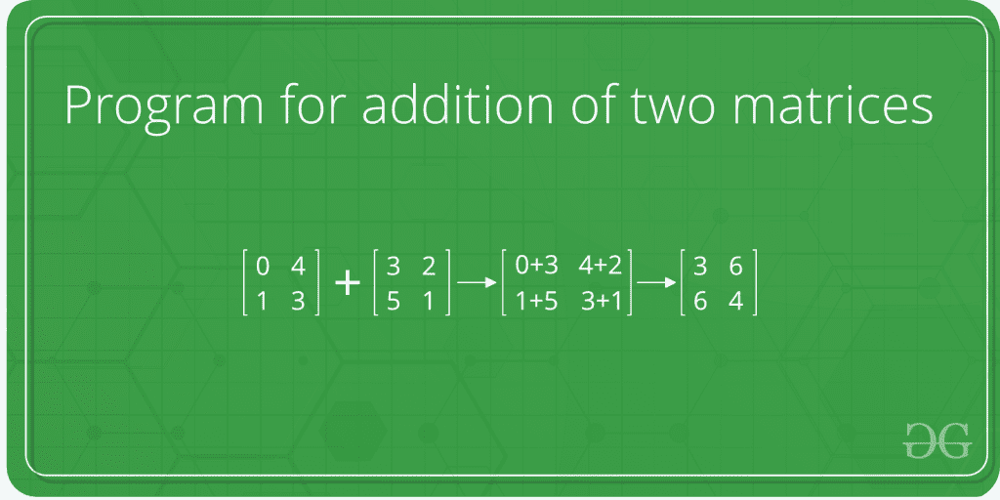

# 用于添加两个矩阵的程序

> 原文： [https://www.geeksforgeeks.org/c-program-addition-two-matrices/](https://www.geeksforgeeks.org/c-program-addition-two-matrices/)



下面的程序添加了两个大小为 4 * 4 的正方形矩阵，我们可以将 N 更改为不同的维度。

## [推荐：请先在“ ***<u>实践</u>*** ”上解决它，然后再继续解决。](https://practice.geeksforgeeks.org/problems/addition-of-two-square-matrices/0)

## C++ 

```

// C++ program for addition  
// of two matrices 
#include <bits/stdc++.h> 
using namespace std; 
#define N 4  

// This function adds A[][] and B[][], and stores  
// the result in C[][]  
void add(int A[][N], int B[][N], int C[][N])  
{  
    int i, j;  
    for (i = 0; i < N; i++)  
        for (j = 0; j < N; j++)  
            C[i][j] = A[i][j] + B[i][j];  
}  

// Driver code 
int main()  
{  
    int A[N][N] = { {1, 1, 1, 1},  
                    {2, 2, 2, 2},  
                    {3, 3, 3, 3},  
                    {4, 4, 4, 4}};  

    int B[N][N] = { {1, 1, 1, 1},  
                    {2, 2, 2, 2},  
                    {3, 3, 3, 3},  
                    {4, 4, 4, 4}};  

    int C[N][N]; // To store result  
    int i, j;  
    add(A, B, C);  

    cout << "Result matrix is " << endl;  
    for (i = 0; i < N; i++)  
    {  
        for (j = 0; j < N; j++)  
        cout << C[i][j] << " ";  
        cout << endl; 
    }  

    return 0;  
}  

// This code is contributed by rathbhupendra 

```

## C

```

#include <stdio.h> 
#define N 4 

// This function adds A[][] and B[][], and stores 
// the result in C[][] 
void add(int A[][N], int B[][N], int C[][N]) 
{ 
    int i, j; 
    for (i = 0; i < N; i++) 
        for (j = 0; j < N; j++) 
            C[i][j] = A[i][j] + B[i][j]; 
} 

int main() 
{ 
    int A[N][N] = { {1, 1, 1, 1}, 
                    {2, 2, 2, 2}, 
                    {3, 3, 3, 3}, 
                    {4, 4, 4, 4}}; 

    int B[N][N] = { {1, 1, 1, 1}, 
                    {2, 2, 2, 2}, 
                    {3, 3, 3, 3}, 
                    {4, 4, 4, 4}}; 

    int C[N][N]; // To store result 
    int i, j; 
    add(A, B, C); 

    printf("Result matrix is \n"); 
    for (i = 0; i < N; i++) 
    { 
        for (j = 0; j < N; j++) 
           printf("%d ", C[i][j]); 
        printf("\n"); 
    } 

    return 0; 
} 

```

## 爪哇

```

// Java program for addition  
// of two matrices 

class GFG 
{ 
    static final int N = 4; 

    // This function adds A[][] and B[][], and stores 
    // the result in C[][] 
    static void add(int A[][], int B[][], int C[][]) 
    { 
        int i, j; 
        for (i = 0; i < N; i++) 
            for (j = 0; j < N; j++) 
                C[i][j] = A[i][j] + B[i][j]; 
    } 

    // Driver code 
    public static void main (String[] args) 
    { 
        int A[][] = { {1, 1, 1, 1}, 
                        {2, 2, 2, 2}, 
                        {3, 3, 3, 3}, 
                        {4, 4, 4, 4}}; 

        int B[][] = { {1, 1, 1, 1}, 
                        {2, 2, 2, 2}, 
                        {3, 3, 3, 3}, 
                        {4, 4, 4, 4}}; 

        // To store result 
        int C[][] = new int[N][N];  
        int i, j; 
        add(A, B, C); 

        System.out.print("Result matrix is \n"); 
        for (i = 0; i < N; i++) 
        { 
            for (j = 0; j < N; j++) 
            System.out.print(C[i][j] + " "); 
            System.out.print("\n"); 
        } 
    } 
} 

// This code is contributed by Anant Agarwal. 

```

## Python3

```

# Python3 program for addition  
# of two matrices 

N = 4

# This function adds A[][] 
# and B[][], and stores 
# the result in C[][] 
def add(A,B,C): 

    for i in range(N): 
        for j in range(N): 
            C[i][j] = A[i][j] + B[i][j] 

# driver code 
A = [ [1, 1, 1, 1], 
    [2, 2, 2, 2], 
    [3, 3, 3, 3], 
    [4, 4, 4, 4]] 

B= [ [1, 1, 1, 1], 
    [2, 2, 2, 2], 
    [3, 3, 3, 3], 
    [4, 4, 4, 4]] 

C=A[:][:] # To store result 

add(A, B, C) 

print("Result matrix is") 
for i in range(N): 
    for j in range(N): 
        print(C[i][j], " ", end='') 
    print() 

# This code is contributed 
# by Anant Agarwal. 

```

## C# 

```

// C# program for addition  
// of two matrices 
using System; 

class GFG 
{ 
    static int N = 4; 

    // This function adds A[][] and B[][], and stores 
    // the result in C[][] 
    static void add(int[,] A, int [,]B, int [,]C) 
    { 
        int i, j; 
        for (i = 0; i < N; i++) 
            for (j = 0; j < N; j++) 
                C[i,j] = A[i,j] + B[i,j]; 
    } 

    // Driver code 
    public static void Main () 
    { 
        int [,]A = { {1, 1, 1, 1}, 
                        {2, 2, 2, 2}, 
                        {3, 3, 3, 3}, 
                        {4, 4, 4, 4}}; 

        int [,]B = { {1, 1, 1, 1}, 
                        {2, 2, 2, 2}, 
                        {3, 3, 3, 3}, 
                        {4, 4, 4, 4}}; 

        // To store result 
        int [,]C = new int[N,N];  
        int i, j; 
        add(A, B, C); 

    Console.WriteLine("Result matrix is "); 
        for (i = 0; i < N; i++) 
        { 
            for (j = 0; j < N; j++) 
            Console.Write(C[i,j] + " "); 
            Console.WriteLine(); 
        } 
    } 
} 

// This code is contributed by vt_m. 

```

## PHP

```

<?php 
// This function adds A[][] and  
// B[][], and stores the result in C[][] 
function add(&$A, &$B, &$C) 
{ 
    $N = 4; 
    for ($i = 0; $i < $N; $i++) 
        for ($j = 0; $j < $N; $j++) 
            $C[$i][$j] = $A[$i][$j] +  
                         $B[$i][$j]; 
} 

// Driver code 
$A = array(array(1, 1, 1, 1), 
           array(2, 2, 2, 2), 
           array(3, 3, 3, 3), 
           array(4, 4, 4, 4)); 

$B = array(array(1, 1, 1, 1), 
           array(2, 2, 2, 2), 
           array(3, 3, 3, 3), 
           array(4, 4, 4, 4)); 

$N = 4; 
add($A, $B, $C); 

echo "Result matrix is \n"; 
for ($i = 0; $i < $N; $i++) 
{ 
    for ($j = 0; $j < $N; $j++) 
    { 
        echo $C[$i][$j]; 
        echo " "; 
    } 
    echo "\n" ; 
} 

// This code is contributed  
// by Shivi_Aggarwal 
?> 

```

**输出**：

```
Result matrix is
2 2 2 2
4 4 4 4
6 6 6 6
8 8 8 8
```

该程序可以扩展为矩形矩阵。 以下帖子对于扩展该程序很有用。
 [如何在 C 中将 2D 数组作为参数传递？](https://www.geeksforgeeks.org/pass-2d-array-parameter-c/)

上述程序的时间复杂度是 O（n <sup>2</sup> ）。

如果发现任何不正确的地方，或者想分享有关上述主题的更多信息，请发表评论

现在不要停下来，将您的学习提高到一个新的水平。 借助最受信任的课程，学习数据结构和算法的所有重要概念： [DSA Self Paced](https://practice.geeksforgeeks.org/courses/dsa-self-paced?utm_source=geeksforgeeks&utm_medium=article&utm_campaign=gfg_article_dsa_content_bottom) 。 以对学生友好的价格准备好行业。