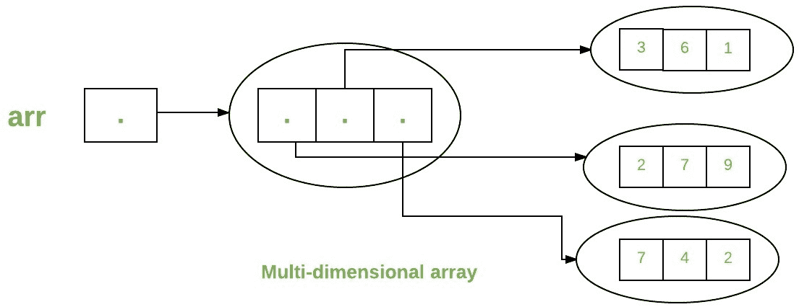
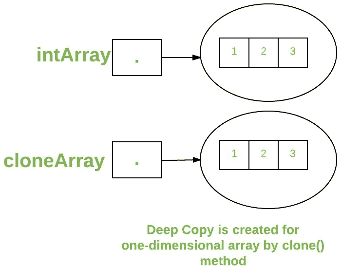
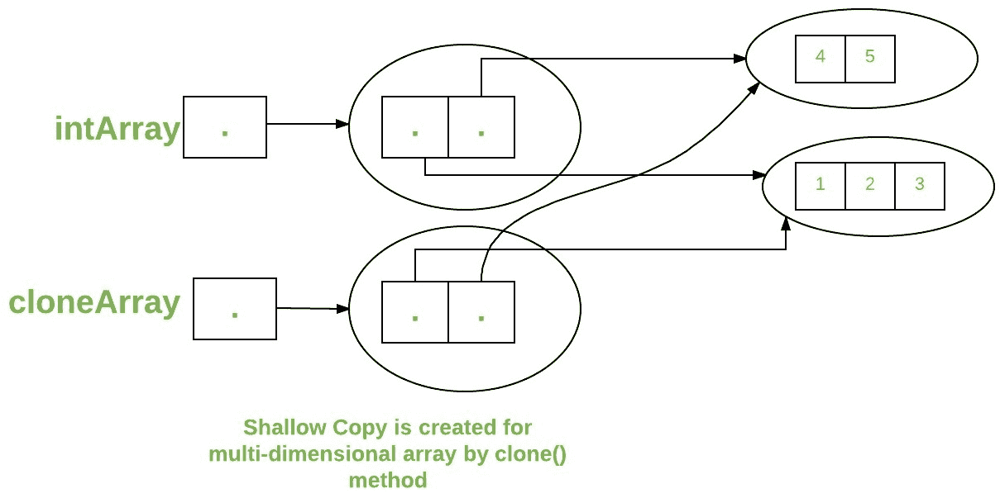

# Java 中的数组

> 原文： [https://www.geeksforgeeks.org/arrays-in-java/](https://www.geeksforgeeks.org/arrays-in-java/)

数组是一组由通用名称引用的相似类型的变量。Java 中的数组工作方式与 C/C++ 中的不同。 以下是有关 Java 数组的一些要点。

*   在 Java 中，所有数组都是动态分配的。（下面讨论）
*   由于数组是 Java 中的对象，因此我们可以使用成员长度来找到它们的长度。 这与 C/C++ 不同，在 C/C++ 中，我们使用`sizeof`查找长度。
*   像其他变量一样，也可以在数据类型之后使用`[]`声明 Java 数组变量。
*   数组中的变量是有序的，每个变量的索引都从 0 开始。
*   Java 数组也可以用作静态字段，局部变量或方法参数。
*   数组的**大小**必须由`int`值指定，且不能长或短。
*   数组类型的直接超类是[对象](https://www.geeksforgeeks.org/object-class-in-java/)。
*   每种数组类型都实现接口 [Cloneable](https://www.geeksforgeeks.org/marker-interface-java/) 和 [java.io.Serializable](https://www.geeksforgeeks.org/serialization-in-java/) 。

数组可以包含类的基元（`int`，`char`等）以及对象的对象（或非基元）引用，具体取决于数组的定义。 对于基元数据类型，实际值存储在连续的存储位置中。 对于[类的对象](https://www.geeksforgeeks.org/g-fact-46/)，实际对象存储在堆段中。

[](https://media.geeksforgeeks.org/wp-content/uploads/Arrays1.png)

**创建，初始化和访问数组**

**一维数组**：
一维数组声明的一般形式是

```
type var-name[];
OR
type[] var-name;

```

数组声明有两个组成部分：类型和名称。 *类型*声明数组的元素类型。 元素类型确定组成数组的每个元素的数据类型。 像`int`类型的数组一样，我们还可以创建其他原始数据类型的数组，例如`char`，`float`，`double`.. 等或用户定义的数据类型（类的对象）。因此，数组的元素类型决定了哪种类型的 数组将保存的数据。
**例如**：

```
// both are valid declarations
int intArray[]; 
or int[] intArray; 

byte byteArray[];
short shortsArray[];
boolean booleanArray[];
long longArray[];
float floatArray[];
double doubleArray[];
char charArray[];

// an array of references to objects of
// the class MyClass (a class created by
// user)
MyClass myClassArray[]; 

Object[]  ao,        // array of Object
Collection[] ca;  // array of Collection
                     // of unknown type

```

尽管上述第一个声明确定了`intArray`是一个数组变量的事实，但**实际上没有数组**。 它只是告诉编译器这个（`intArray`）变量将保存一个整数类型的数组。 要将`intArray`与实际的物理整数数组链接，必须使用新的**新**分配一个并将其分配给`intArray`。

**实例化 Java 中的数组**

声明数组时，仅创建数组的引用。 要实际创建数组或为数组提供内存，您可以这样创建一个数组： *new* 应用于一维数组的一般形式如下所示：

```
var-name = new type [size];

```

此处，*类型*指定要分配的数据类型，*大小*指定数组中元素的数量， *var-name* 是数组变量的名称， 链接到数组。 也就是说，要使用*新的*分配数组，**必须指定要分配的元素的类型和数量。**

**示例**：

```
int intArray[];    //declaring array
intArray = new int[20];  // allocating memory to array

```

要么

```
int[] intArray = new int[20]; // combining both statements in one
```

**注意**：

1.  由*新*分配的数组中的元素将自动初始化为**零**（对于数字类型），**假**（对于布尔值）或 **null** （用于参考类型）。请参考 [Java](https://www.geeksforgeeks.org/default-array-values-in-java/) 中的默认数组值
2.  获取数组是一个两步过程。 首先，必须声明所需数组类型的变量。 其次，您必须使用`new`分配用于保存数组的内存，并将其分配给数组变量。 因此，Java 中的**所有数组都是动态分配的**。

**数组文字**

在已知数组大小和数组变量的情况下，可以使用数组文字。

```
 int[] intArray = new int[]{ 1,2,3,4,5,6,7,8,9,10 }; 
 // Declaring array literal
```

*   该数组的长度决定了所创建数组的长度。
*   无需在最新版本的 Java 中编写新的`int[]`部分

**使用`for`循环**访问 Java 数组元素

数组中的每个元素均通过其索引访问。 索引以 0 开头，以（总数组大小`- 1`） 结束。 可以使用 Java `for`循环访问数组的所有元素。

```

// accessing the elements of the specified array
for (int i = 0; i < arr.length; i++)
  System.out.println("Element at index " + i + 
                                " : "+ arr[i]);

```

**实施**：

```

// Java program to illustrate creating an array 
// of integers,  puts some values in the array, 
// and prints each value to standard output. 

class GFG  
{ 
    public static void main (String[] args)  
    {          
      // declares an Array of integers. 
      int[] arr; 

      // allocating memory for 5 integers. 
      arr = new int[5]; 

      // initialize the first elements of the array 
      arr[0] = 10; 

      // initialize the second elements of the array 
      arr[1] = 20; 

      //so on... 
      arr[2] = 30; 
      arr[3] = 40; 
      arr[4] = 50; 

      // accessing the elements of the specified array 
      for (int i = 0; i < arr.length; i++) 
         System.out.println("Element at index " + i +  
                                      " : "+ arr[i]);           
    } 
} 

```

输出：

```
Element at index 0 : 10
Element at index 1 : 20
Element at index 2 : 30
Element at index 3 : 40
Element at index 4 : 50

```

您还可以使用[`foreach`循环](https://www.geeksforgeeks.org/for-each-loop-in-java/)访问 Java 数组


**对象数组**

对象数组的创建方式类似于原始类型数据项的数组，其创建方法如下。

```
 Student[] arr = new Student[7]; //student is a user-defined class
```

`studentArray`包含七个内存空间，每个内存空间可以容纳七个学生类，每个学生类的大小可以存储七个学生对象的地址。必须使用学生类的构造函数实例化学生对象，并且应将其引用分配给数组中的数组元素。 以下方式。

```
Student[] arr = new Student[5];
```

```

// Java program to illustrate creating an array of 
// objects 

class Student 
{ 
    public int roll_no; 
    public String name; 
    Student(int roll_no, String name) 
    { 
        this.roll_no = roll_no; 
        this.name = name; 
    } 
} 

// Elements of array are objects of a class Student. 
public class GFG 
{ 
    public static void main (String[] args) 
    { 
        // declares an Array of integers. 
        Student[] arr; 

        // allocating memory for 5 objects of type Student. 
        arr = new Student[5]; 

        // initialize the first elements of the array 
        arr[0] = new Student(1,"aman"); 

        // initialize the second elements of the array 
        arr[1] = new Student(2,"vaibhav"); 

        // so on... 
        arr[2] = new Student(3,"shikar"); 
        arr[3] = new Student(4,"dharmesh"); 
        arr[4] = new Student(5,"mohit"); 

        // accessing the elements of the specified array 
        for (int i = 0; i < arr.length; i++) 
            System.out.println("Element at " + i + " : " + 
                        arr[i].roll_no +" "+ arr[i].name); 
    } 
} 

```

Output:

```
Element at 0 : 1 aman
Element at 1 : 2 vaibhav
Element at 2 : 3 shikar
Element at 3 : 4 dharmesh
Element at 4 : 5 mohit

```

**如果我们尝试访问数组大小以外的元素会发生什么？**

JVM 抛出`ArrayIndexOutOfBoundsException`，以指示已使用非法索引访问了数组。 索引为负或大于或等于数组的大小。

```

class GFG 
{ 
    public static void main (String[] args) 
    { 
        int[] arr = new int[2]; 
        arr[0] = 10; 
        arr[1] = 20; 

        for (int i = 0; i <= arr.length; i++) 
            System.out.println(arr[i]); 
    } 
} 

```

运行时错误

```
Exception in thread "main" java.lang.ArrayIndexOutOfBoundsException: 2
    at GFG.main(File.java:12)

```

Output:

```
10
20

```

**多维数组**

多维数组是数组的**数组，该数组的每个元素都包含其他数组的引用。 这些也称为[锯齿数组](https://www.geeksforgeeks.org/jagged-array-in-java/)。 通过在每个维上附加一组方括号（[]）来创建多维数组。 例子**：

```
int[][] intArray = new int[10][20]; //a 2D array or matrix
int[][][] intArray = new int[10][20][10]; //a 3D array

```

```

class multiDimensional 
{ 
    public static void main(String args[]) 
    { 
        // declaring and initializing 2D array 
        int arr[][] = { {2,7,9},{3,6,1},{7,4,2} }; 

        // printing 2D array 
        for (int i=0; i< 3 ; i++) 
        { 
            for (int j=0; j < 3 ; j++) 
                System.out.print(arr[i][j] + " "); 

            System.out.println(); 
        } 
    } 
} 

```

Output:

```
2 7 9 
3 6 1 
7 4 2 

```



**将数组传递给方法**

像变量一样，我们也可以将数组传递给方法。例如，下面的程序将数组传递给方法 *sum* 以计算数组值的总和。

```

// Java program to demonstrate  
// passing of array to method 

class Test 
{     
    // Driver method 
    public static void main(String args[])  
    { 
        int arr[] = {3, 1, 2, 5, 4}; 

        // passing array to method m1 
        sum(arr); 

    } 

    public static void sum(int[] arr)  
    { 
        // getting sum of array values 
        int sum = 0; 

        for (int i = 0; i < arr.length; i++) 
            sum+=arr[i]; 

        System.out.println("sum of array values : " + sum); 
    } 
} 

```

输出：

```
sum of array values : 15

```

**从方法**返回数组

和往常一样，方法也可以返回数组。 例如，下面的程序从方法 *m1* 返回一个数组。

```

// Java program to demonstrate  
// return of array from method 

class Test 
{     
    // Driver method 
    public static void main(String args[])  
    { 
        int arr[] = m1(); 

        for (int i = 0; i < arr.length; i++) 
            System.out.print(arr[i]+" "); 

    } 

    public static int[] m1()  
    { 
        // returning  array 
        return new int[]{1,2,3}; 
    } 
} 

```

Output:

```
1 2 3

```

**[类](https://www.geeksforgeeks.org/java-lang-class-class-java-set-1/)数组的对象**

每个数组都有一个关联的[类](https://www.geeksforgeeks.org/java-lang-class-class-java-set-1/)对象，该对象与具有相同组件类型的所有其他数组共享。

```

// Java program to demonstrate  
// Class Objects for Arrays 

class Test 
{  
    public static void main(String args[])  
    { 
        int intArray[] = new int[3]; 
        byte byteArray[] = new byte[3]; 
        short shortsArray[] = new short[3]; 

        // array of Strings 
        String[] strArray = new String[3]; 

        System.out.println(intArray.getClass()); 
        System.out.println(intArray.getClass().getSuperclass()); 
        System.out.println(byteArray.getClass()); 
        System.out.println(shortsArray.getClass()); 
        System.out.println(strArray.getClass()); 
    } 
} 

```

Output:

```
class [I
class java.lang.Object
class [B
class [S
class [Ljava.lang.String;

```

**说明**：

1.  字符串“`I`”是类对象“组件类型为`int`的数组”的运行时类型签名。
2.  任何数组类型的唯一直接超类是[`java.lang.Object`](https://www.geeksforgeeks.org/object-class-in-java/)。
3.  字符串“`B`”是类对象“组件类型为*字节*”的数组的运行时类型签名。
4.  字符串“`S`”是类对象“组件类型为*短为*的数组”的运行时类型签名。
5.  字符串“`L`”是类对象“具有类的组件类型的数组”的运行时类型签名。 然后跟随类名。

**数组成员**

现在您知道数组是类的对象，数组的直接超类是类[对象](https://www.geeksforgeeks.org/object-class-in-java/)。数组类型的成员如下：

*   公共最终字段*长度*，其中包含数组的组件数。 *长度*可以为正或为零。
*   从类[`Object`继承的所有成员；](https://www.geeksforgeeks.org/object-class-in-java/) 对象的唯一方法是[克隆](https://www.geeksforgeeks.org/clone-method-in-java-2/)方法。
*   公共方法`clone()`，它重写类`Object`中的克隆方法，并且不抛出[检查的异常](https://www.geeksforgeeks.org/checked-vs-unchecked-exceptions-in-java/)。

**克隆数组**

*   When you clone a single dimensional array, such as Object[], a “deep copy” is performed with the new array containing copies of the original array’s elements as opposed to references.

    ```

    // Java program to demonstrate  
    // cloning of one-dimensional arrays 

    class Test 
    {     
        public static void main(String args[])  
        { 
            int intArray[] = {1,2,3}; 

            int cloneArray[] = intArray.clone(); 

            // will print false as deep copy is created 
            // for one-dimensional array 
            System.out.println(intArray == cloneArray); 

            for (int i = 0; i < cloneArray.length; i++) { 
                System.out.print(cloneArray[i]+" "); 
            } 
        } 
    } 

    ```

    Output:

    ```
    false
    1 2 3

    ```

    

*   A clone of a multidimensional array (like Object[][]) is a “shallow copy” however, which is to say that it creates only a single new array with each element array a reference to an original element array but subarrays are shared.

    ```

    // Java program to demonstrate  
    // cloning of multi-dimensional arrays 

    class Test 
    {     
        public static void main(String args[])  
        { 
            int intArray[][] = {{1,2,3},{4,5}}; 

            int cloneArray[][] = intArray.clone(); 

            // will print false 
            System.out.println(intArray == cloneArray); 

            // will print true as shallow copy is created 
            // i.e. sub-arrays are shared 
            System.out.println(intArray[0] == cloneArray[0]); 
            System.out.println(intArray[1] == cloneArray[1]); 

        } 
    } 

    ```

    Output:

    ```
    false
    true
    true

    ```

    

**相关文章**：
[Java 中的锯齿数组](https://www.geeksforgeeks.org/jagged-array-in-java/)
[Java 中的`For-each`循环](https://www.geeksforgeeks.org/for-each-loop-in-java/)
[Java 中的数组类](https://www.geeksforgeeks.org/array-class-in-java/)

**参考**：Oracle 的[数组](https://docs.oracle.com/javase/tutorial/java/nutsandbolts/arrays.html)

本文由 **Nitsdheerendra 和 Gaurav Miglani** 提供。 如果您喜欢 GeeksforGeeks 并希望做出贡献，则也可以使用 [tribution.geeksforgeeks.org](http://www.contribute.geeksforgeeks.org) 撰写文章，或将您的文章邮寄至 tribution@geeksforgeeks.org。 查看您的文章出现在 GeeksforGeeks 主页上，并帮助其他 Geeks。

如果发现任何不正确的地方，或者想分享有关上述主题的更多信息，请写评论。

