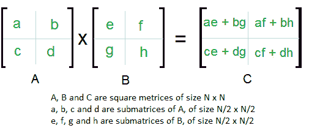
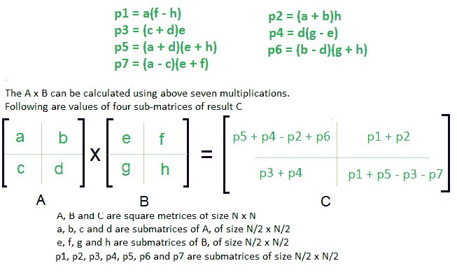

# 分而治之| 第 5 组（Strassen 的矩阵乘法）

> 原文： [https://www.geeksforgeeks.org/strassens-matrix-multiplication/](https://www.geeksforgeeks.org/strassens-matrix-multiplication/)

给定两个大小分别为 n x n 的平方矩阵 A 和 B，找到它们的乘法矩阵。

***朴素的方法***
以下是将两个矩阵相乘的简单方法。

```

void multiply(int A[][N], int B[][N], int C[][N]) 
{ 
    for (int i = 0; i < N; i++) 
    { 
        for (int j = 0; j < N; j++) 
        { 
            C[i][j] = 0; 
            for (int k = 0; k < N; k++) 
            { 
                C[i][j] += A[i][k]*B[k][j]; 
            } 
        } 
    } 
} 

```

上述方法的时间复杂度为 O（N <sup>3</sup> ）。

***分而治之***
以下是简单的分而治之方法来将两个平方矩阵相乘。
1）如下图所示，将矩阵 A 和 B 划分为大小为 N / 2 x N / 2 的 4 个子矩阵。
2）递归计算以下值。 ae + bg，af + bh，ce + dg 和 cf + dh。

[](https://www.geeksforgeeks.org/wp-content/uploads/strassen_new.png)

在上述方法中，我们对大小为 N / 2 x N / 2 的矩阵进行了 8 次乘法运算，并进行了 4 次加法运算。 两个矩阵相加需要 O（N <sup>2</sup> ）时间。 所以时间复杂度可以写成

```
T(N) = 8T(N/2) + O(N2)  

From Master's Theorem, time complexity of above method is O(N3)
which is unfortunately same as the above naive method.

```

***简单分而治之也导致 O（N <sup>3</sup> ），是否有更好的方法？***
在上述分治法中，高时间复杂度的主要组成部分是 8 个递归调用。 **Strassen 方法**的想法是将递归调用的数量减少到 7。Strassen 方法类似于上述简单的分治法，因为该方法还将矩阵划分为大小为 N /的子矩阵 如上图所示，为 2 x N / 2，但是在 Strassen 方法中，使用以下公式计算结果的四个子矩阵。

[](https://www.geeksforgeeks.org/wp-content/uploads/stressen_formula_new_new.png)

**Strassen 方法的时间复杂度**
两个矩阵的加法和减法需要 O（N <sup>2</sup> ）时间。 所以时间复杂度可以写成

```
T(N) = 7T(N/2) +  O(N2)

From Master's Theorem, time complexity of above method is 
O(NLog7) which is approximately O(N2.8074)

```

通常，出于以下原因，在实际应用中不建议使用 Strassen 方法。
1）Strassen 方法中使用的常数很高，对于典型的应用，朴素方法效果更好。
2）对于稀疏矩阵，有专门针对它们设计的更好方法。
3）递归中的子矩阵占用额外的空间。
4）由于非整数值的计算机算法精度有限，因此与自然方法相比，斯特拉森算法中累积的错误更大（来源： [CLRS 书](http://www.flipkart.com/introduction-algorithms-3rd/p/itmczynzhyhxv2gs?pid=9788120340077&affid=sandeepgfg)）

```

# Version 3.6 

import numpy as np 

def split(matrix): 
    """ 
    Splits a given matrix into quarters. 
    Input: nxn matrix 
    Output: tuple containing 4 n/2 x n/2 matrices corresponding to a, b, c, d 
    """
    row, col = matrix.shape 
    row2, col2 = row//2, col//2
    return matrix[:row2, :col2], matrix[:row2, col2:], matrix[row2:, :col2], matrix[row2:, col2:] 

def strassen(x, y): 
    """ 
    Computes matrix product by divide and conquer approach, recursively. 
    Input: nxn matrices x and y 
    Output: nxn matrix, product of x and y 
    """

    # Base case when size of matrices is 1x1 
    if len(x) == 1: 
        return x * y 

    # Splitting the matrices into quadrants. This will be done recursively 
    # untill the base case is reached. 
    a, b, c, d = split(x) 
    e, f, g, h = split(y) 

    # Computing the 7 products, recursively (p1, p2...p7) 
    p1 = strassen(a, f - h)   
    p2 = strassen(a + b, h)         
    p3 = strassen(c + d, e)         
    p4 = strassen(d, g - e)         
    p5 = strassen(a + d, e + h)         
    p6 = strassen(b - d, g + h)   
    p7 = strassen(a - c, e + f)   

    # Computing the values of the 4 quadrants of the final matrix c 
    c11 = p5 + p4 - p2 + p6   
    c12 = p1 + p2            
    c21 = p3 + p4             
    c22 = p1 + p5 - p3 - p7   

    # Combining the 4 quadrants into a single matrix by stacking horizontally and vertically. 
    c = np.vstack((np.hstack((c11, c12)), np.hstack((c21, c22))))  

    return c 

```

[记住 Strassen 矩阵方程](https://www.geeksforgeeks.org/easy-way-remember-strassens-matrix-equation/)的简便方法

**参考**：
[算法入门第三版，作者：Clifford Stein，Thomas H. Cormen，Charles E. Leiserson，Ronald L.Rivest](http://www.flipkart.com/introduction-algorithms-3rd/p/itmczynzhyhxv2gs?pid=9788120340077&affid=sandeepgfg)
[https：// www.youtube.com/watch?v=LOLebQ8nKHA](https://www.youtube.com/watch?v=LOLebQ8nKHA)
[https://www.youtube.com/watch?v=QXY4RskLQcI](https://www.youtube.com/watch?v=QXY4RskLQcI)

如果发现任何不正确的地方，或者想分享有关上述主题的更多信息，请发表评论

